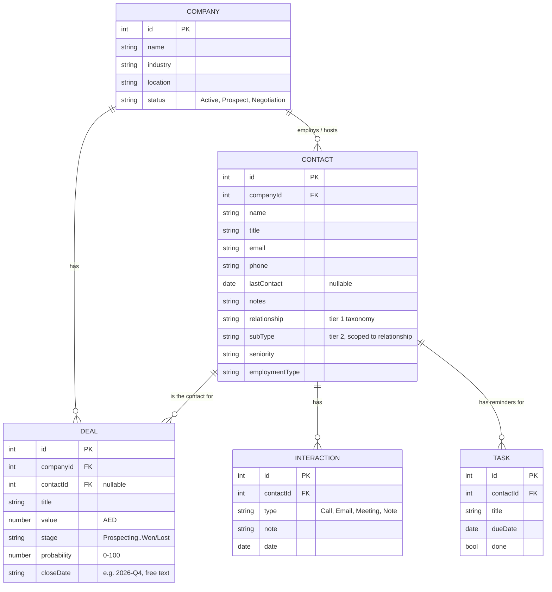

# ALSUWEIDI ERP — Specification

**Status**: Frontend-only UI proof-of-concept. No backend, no database, no persistence — every screen runs on in-memory React state seeded from dummy data.

**Why it's built this way**: the goal right now is management sign-off on look-and-feel and workflow *before* investing engineering time in a real backend. Everything documented here is the requirements gathered by building working UI and iterating on real feedback, not a spec written up front — treat it as the source of truth for what to build against once backend work starts.

If you're a developer, an AI agent, or anyone picking this project up cold: read this file first, then `README.md` for run/deploy instructions.

---

## 1. Architecture

- **Frontend**: React 18 + Vite + Tailwind CSS + React Router. No backend, no API calls, no database.
- **State**: all data lives in `useState` at the page level (`pages/CRM.jsx`, `pages/HR.jsx`) and is passed down as props. Refreshing the page resets everything to the seed data in `data/*.js`. This is intentional for now — see §5.
- **Auth**: cosmetic only. Login is a name + role dropdown, no password, nothing sent anywhere. The `role` field is stored on the user object but **does not currently filter or restrict anything** — see §5.
- **Hosting**: [github.com/sanalogy-code/alsuweidi-erp-demo](https://github.com/sanalogy-code/alsuweidi-erp-demo) → Cloudflare Pages, auto-deploys on push to `master`.
- **Dependencies of note**: `lucide-react` (icons), `xlsx` (Excel/CSV export, lazy-loaded via dynamic `import()` so it doesn't bloat the main bundle — installed from SheetJS's own CDN build, not the npm registry package, which has two unpatched CVEs that don't apply to write-only usage but aren't worth shipping anyway).

### Local dev

Work from `C:\Users\sdiab\Projects\alsuweidi-erp-demo` on **local disk**. A separate copy at `G:\My Drive\Claude Projects\alsuweidi-erp-demo` exists but Google Drive's virtual filesystem makes `npm install`/`vite dev` unusably slow (it doesn't support the junctions/symlinks needed to bridge to local disk either) — treat that copy as stale/reference-only.

```
cd frontend
npm install
npm run dev      # local dev server
npm run build    # production build, also the fastest correctness check
```

---

## 2. Data Model

All entities are flat arrays with foreign-key-style ID fields, defined in `frontend/src/data/crmData.js` (CRM) and `frontend/src/data/hrData.js` (HR). This shape maps directly onto relational database tables — that was a deliberate choice so this translates cleanly to a real schema later.



### Contact taxonomy (two-tier)

`relationship` is tier 1, `subType` is tier 2 and is scoped to a specific relationship. This mapping lives in `SUBTYPES_BY_RELATIONSHIP` in `crmData.js` and drives the cascading dropdown in the export filter (§3.5) — selecting a relationship narrows which sub-types are even selectable.

| Relationship | Valid Sub-Types |
|---|---|
| Client | Decision Maker, Technical Contact, Procurement, End User |
| Prospect | Cold Lead, Warm Lead, Referral |
| Vendor/Supplier | Subcontractor, Material Supplier, Software Vendor |
| Partner | JV Partner, Strategic Alliance |
| Government/Regulator | Regulator, Client Agency, Licensing Authority |
| Employee | Secondment, Site-Based, HQ |

`seniority` is one flat enum: `Entry, Senior, Manager, Director, VP, C-Suite` — deliberately matching the seniority tiers already used in the (not-yet-built) Marketing module's LinkedIn follower breakdown, so the same categorization is reusable across modules later.

`employmentType` is one flat enum: `Full-time, Part-time, Contractor, Consultant, Freelance` — describes the contact's employment status **at their own company**, not at ALSUWEIDI (except for `relationship: Employee` contacts, who are ALSUWEIDI staff embedded elsewhere, e.g. a site secondment).

### Deal stages

`Prospecting → Proposal → Negotiation → Won / Lost` (`STAGES` in `crmData.js`). `Won` and `Lost` are terminal. Pipeline value calculations generally exclude `Lost` (and often `Won`, when the question is "what's still open") — check each usage site, the exclusion isn't automatic.

---

## 3. Feature Map

### CRM (`pages/CRM.jsx`, all state owned here and passed down)

1. **Overview** (`OverviewView`) — dashboard: stat cards (companies, open pipeline value, weighted expected value, needs-follow-up count, tasks-overdue count), plus widgets: Needs Follow-Up (contacts untouched 14+ days), Reminders (tasks due within 7 days), Closing Soon (deals by close date), Top Clients by value, Pipeline by Stage breakdown.
2. **Pipeline** (`PipelineView`) — Kanban board by deal stage. Drag-and-drop or per-card dropdown to change stage. **Unified date range selector:** preset dropdown (All Time / This Year / This Quarter / This Month) or custom date picker (From/To dates). Filters respond in real-time. Handles ISO dates, quarter format (2026-Q3), and year format (2026). Edit button (pencil icon) on each card opens `DealEditModal` (edit title/value/stage/probability/close date, or delete with confirmation). Summary bar: open pipeline, weighted expected, won total, win rate.
3. **Companies** (`CompaniesView`) — searchable list + detail drill-down (Contacts / Deals / Activity tabs). Edit button in company header opens `CompanyEditModal` (edit name/industry/location/status, or delete with confirmation). Activity tab shows real logged interactions.
4. **Contacts** (`ContactsView`) — searchable directory. Click name → `ContactDetailModal` (info, inline edit, linked deals, full interaction history, quick actions). "Export" button → `ExportContactsModal` (filters + live preview + Excel/CSV export, client-side).
5. **Tasks** (`TasksView`) — reminders tied to contacts, grouped Overdue / Due This Week / Later / Done.
6. **Reports** — **Redesigned:** Unified date range selector (same as Pipeline: presets + custom picker). Shows two views filtered by the same date range: Monthly Breakdown (aggregated by month) + All Deals list (individual deal rows with company, title, value, stage, probability, close date). Company/Stage filters inline. One-click Excel CSV download includes both views + summary. Handles all date formats.

Shared modals: `Modal.jsx` (base — supports `wide` and `layered` variants; `layered` bumps z-index for modals-within-modals, e.g. Log Interaction from Contact Detail renders on top).

### HR (`pages/HR.jsx`)

1. **Overview** — stat cards (employees, departments, new hires), call-out to Onboarding, quick links (not yet functional).
2. **Directory** (`EmployeeList`, `EmployeeDetailModal`) — searchable employee list (name, title, dept, email, phone). Click name → full profile modal with tabs:
   - **Info tab:** employment details (title, dept, location, employment type, start date, tenure)
   - **Visa & Dependents tab:** visa status + expiry + sponsor + passport #; dependents (name, relationship, DOB)
   - **Accomplishments tab:** certifications (PE, BIM, Safety, etc.) with issuer, date issued, expiry
   - **Documents tab:** placeholder for Phase 2 (CV, certs, passport uploads)
3. **Accomplishments** (`AccomplishmentsSearch`) — **NEW:** Global search + filter across all employees by accomplishment type. Answering "Who has a PE license?" or "Who's BIM certified?" Shows issuer, date, expiry.
4. **Leave** (`LeaveRequestModal`, `LeaveRequestsList`) — form to request leave (type, dates, reason, auto-calculates days). List view shows all requests (pending/approved/denied). **Note:** approval workflow deferred to Phase 2 (needs manager/HR dashboard + conflict checking).
5. **Onboarding** (`OnboardingChecklist`) — 7 sections (reading/policy/how-to/video), per-section checkbox + progress bar + final acknowledgement gate.

---

## 4. UI Conventions

- Brand color is `#c81516` (pulled from the actual logo SVG, registered as `brand`/`brand-dark`/`brand-light` in `tailwind.config.js` — always use these, not hardcoded hex or a guessed Tailwind red).
- **Never build a Tailwind class name via string concatenation at runtime** (e.g. `` `bg-${color}-400` ``) — Tailwind's JIT scanner only picks up classes that appear as complete literal strings in source. This bit us once (`STAGE_BAR_COLOR` in `crmData.js` exists specifically as a literal lookup table to avoid this).
- Page components (`pages/*.jsx`) own state and data mutation handlers; they pass data + callbacks down to view/section components (`components/crm/*.jsx`, `components/hr/*.jsx`). View components don't call `setState` on data they don't own.
- Every add/edit flow is a form inside `Modal`; every list view has search where it makes sense (Companies, Contacts).

---

## 5. Known Gaps — Read Before Building the Backend

This is the honest risk list, not just a TODO.

- **No RBAC / permissions enforcement.** The role picker at login is cosmetic. The original ERP planning docs specced real role-based permissions (marketing read-only, PMs see only their projects, etc.). This is the one area where "UI first, backend later" carries real risk — access control changes *what renders*, not just what an API returns, so retrofitting it onto screens built assuming "show everything" may require rework. Recommend Option 2 for Phase 2 backend: everyone sees limited info (name, title, email, phone, location), HR/Admin see full details (visa, dependents, accomplishments, salary-related fields).
- **No persistence.** Every add/edit/delete is `setState` on in-memory arrays. Refreshing resets to seed data. Fine for Phase 1 demo; Phase 2 backend will fix this.
- **No Leave approval workflow.** Form exists to request leave, but no approval engine, manager/HR dashboard, or conflict checking (preventing 5 people from the same team being out simultaneously). Too complex for Phase 1 without backend; defer to Phase 2.
- **No Attendance tracking.** Fingerprint/card readers + timesheet integration require backend (biometric API, hours validation against projects). Skipped Phase 1.
- **Won deals don't become Projects.** Explicitly deprioritized. A deal that reaches `Won` just sits there; no linked delivery/project entity with timeline/team/budget.
- **No email sending.** Structurally can't be done client-side — needs serverless function + provider (Resend recommended).
- **Leaked credential in git history.** Supabase `service_role` key in `backend/populate_db.py` (commit `6985c30`). Needs rotating in Supabase dashboard — the key is still live until rotated. Not confirmed done as of this writing.
- **No global search**, no charts beyond Overview's bar breakdowns.

---

## 6. Deploy

Push to `master` → Cloudflare Pages rebuilds automatically. To verify a deploy landed (rather than serving a stale cache), compare the JS bundle hash in `frontend/dist/assets/index-*.js` after a local `npm run build` against what `curl`ing the live URL returns — they should match once the deploy finishes (usually 1–3 minutes after push).
