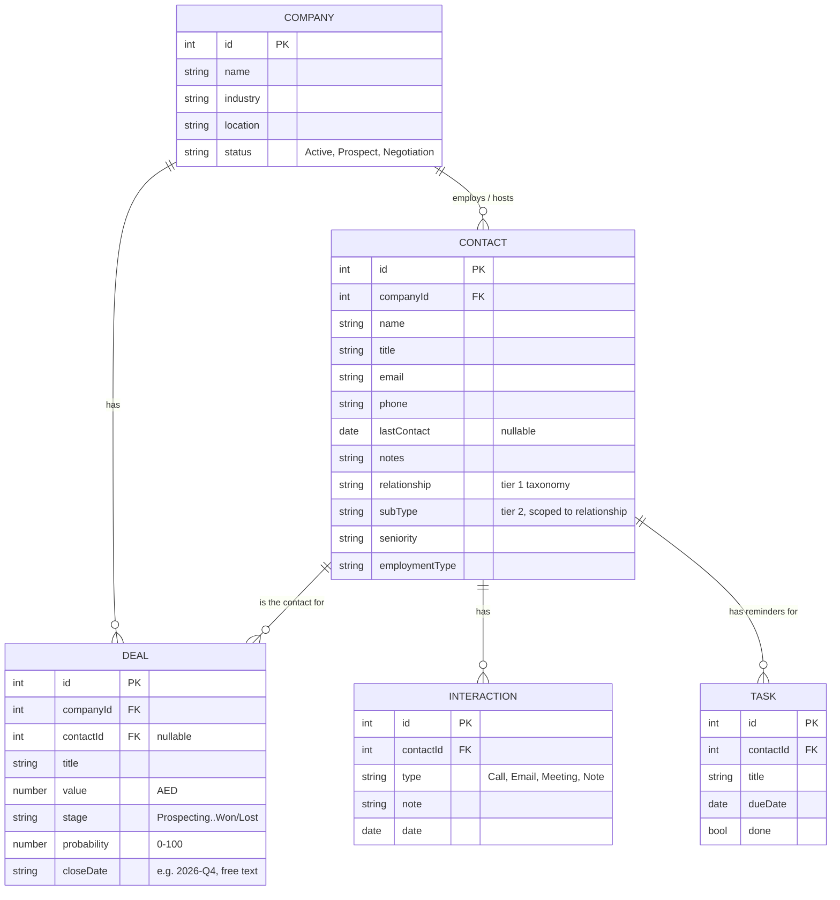

# ALSUWEIDI ERP — Specification

**Status**: Frontend-only UI proof-of-concept. No backend, no database, no persistence — every screen runs on in-memory React state seeded from dummy data.

**Why it's built this way**: the goal right now is management sign-off on look-and-feel and workflow *before* investing engineering time in a real backend. Everything documented here is the requirements gathered by building working UI and iterating on real feedback, not a spec written up front — treat it as the source of truth for what to build against once backend work starts.

If you're a developer, an AI agent, or anyone picking this project up cold: read this file first, then `README.md` for run/deploy instructions.

---

## 1. Architecture

- **Frontend**: React 18 + Vite + Tailwind CSS + React Router. No backend, no API calls, no database.
- **State**: all data lives in `useState` at the page level (`pages/CRM.jsx`, `pages/HR.jsx`, `pages/Projects.jsx`; public holidays are lifted to `App.jsx`) and is passed down as props. Refreshing the page resets everything to the seed data in `data/*.js`. This is intentional for now — see §5.
- **Auth**: cosmetic only. Login is a name + role dropdown, no password, nothing sent anywhere. The `role` field **does** drive what renders (sensitive tabs, HR workspace, project financials — see role groups in §2), but purely client-side; anyone can pick any role — see §5.
- **Hosting**: [github.com/sanalogy-code/alsuweidi-erp-demo](https://github.com/sanalogy-code/alsuweidi-erp-demo) → Cloudflare Pages, auto-deploys on push to `master`.
- **Dependencies of note**: `lucide-react` (icons), `xlsx` (Excel/CSV export, lazy-loaded via dynamic `import()` so it doesn't bloat the main bundle — installed from SheetJS's own CDN build, not the npm registry package, which has two unpatched CVEs that don't apply to write-only usage but aren't worth shipping anyway).

### Local dev

Work from `C:\Users\sdiab\Projects\alsuweidi-erp-demo` on **local disk**. A separate copy at `G:\My Drive\Claude Projects\alsuweidi-erp-demo` exists but Google Drive's virtual filesystem makes `npm install`/`vite dev` unusably slow (it doesn't support the junctions/symlinks needed to bridge to local disk either) — treat that copy as stale/reference-only.

```
cd frontend
npm install
npm run dev      # local dev server
npm run build    # production build, also the fastest correctness check
```

---

## 2. Data Model

All entities are flat arrays with foreign-key-style ID fields, defined in `frontend/src/data/crmData.js` (CRM) and `frontend/src/data/hrData.js` (HR). This shape maps directly onto relational database tables — that was a deliberate choice so this translates cleanly to a real schema later.



### Contact taxonomy (two-tier)

`relationship` is tier 1, `subType` is tier 2 and is scoped to a specific relationship. This mapping lives in `SUBTYPES_BY_RELATIONSHIP` in `crmData.js` and drives the cascading dropdown in the export filter (§3.5) — selecting a relationship narrows which sub-types are even selectable.

| Relationship | Valid Sub-Types |
|---|---|
| Client | Decision Maker, Technical Contact, Procurement, End User |
| Prospect | Cold Lead, Warm Lead, Referral |
| Vendor/Supplier | Subcontractor, Material Supplier, Software Vendor |
| Partner | JV Partner, Strategic Alliance |
| Government/Regulator | Regulator, Client Agency, Licensing Authority |
| Employee | Secondment, Site-Based, HQ |

`seniority` is one flat enum: `Entry, Senior, Manager, Director, VP, C-Suite` — deliberately matching the seniority tiers already used in the (not-yet-built) Marketing module's LinkedIn follower breakdown, so the same categorization is reusable across modules later.

`employmentType` is one flat enum: `Full-time, Part-time, Contractor, Consultant, Freelance` — describes the contact's employment status **at their own company**, not at ALSUWEIDI (except for `relationship: Employee` contacts, who are ALSUWEIDI staff embedded elsewhere, e.g. a site secondment).

### Deal stages

`Prospecting → Proposal → Negotiation → Won / Lost` (`STAGES` in `crmData.js`). `Won` and `Lost` are terminal. Pipeline value calculations generally exclude `Lost` (and often `Won`, when the question is "what's still open") — check each usage site, the exclusion isn't automatic.

### HR Employee model (`frontend/src/data/hrData.js`)

`EMPLOYEE` is a separate flat array, not (yet) related to the CRM entities above. Self-referential via `managerId` — root employees (department heads) have `managerId: null`; everyone else points to another employee's `id`, forming the org chart tree.

| Field | Notes |
|---|---|
| `id`, `name`, `title`, `dept`, `location`, `employmentType`, `email`, `phone`, `mobilePhone` | basic directory fields |
| `startDate`, `status` | tenure calc, active/inactive |
| `managerId` | FK to another `EMPLOYEE.id`, nullable — drives `OrgChart.jsx` and "Reports To" on the Info tab |
| `visa` | `{ status, expiryDate, sponsor, passportNumber }` |
| `dependents` | `[{ name, relationship, dob }]` |
| `accomplishments` | `[{ type, issuer, date, expiryDate }]`, `type` drawn from `ACCOMPLISHMENT_TYPES` |
| `emergencyContact` | `{ name, relationship, phone }` |
| `compensation` | `{ basicSalary, housingAllowance, transportAllowance, otherBenefits, noticePeriodDays }`, all AED/monthly except `otherBenefits` (free text) and `noticePeriodDays` |
| `contractEndDate` | drives the Renewals report alongside visa/passport/insurance expiries |

Since the passport/visa/EID split, employees and each dependent carry their own `passport` `{ number, country, type, issueDate, expiryDate }`, `visa` (null for UAE nationals), `emiratesId`, and (dependents) `insurance`.

### Other HR entities (`hrData.js`)

| Entity | Shape / notes |
|---|---|
| `PUBLIC_HOLIDAYS` | `{ name, date, endDate?, status: approved\|pending, note }` — state lifted to `App.jsx` so HR approvals reach the Home tile in-session; Islamic dates stay pending until moon sighting |
| `LEAVE_REQUESTS` | `{ employeeId, employeeName, type, startDate, endDate, days, reason, status: pending\|approved\|denied, requestedDate }` — `requestedDate` is what the HR Inbox sorts by |
| `CERTIFICATE_REQUESTS` | `{ employeeId, employeeName, type (6 UAE letter types), addressedTo, language (En/Ar/bilingual), purpose, nocObject, status: pending\|issued\|rejected, letterText }` — `letterText` persists the issued letter; templates live in `data/certificateTemplates.js` |
| `COMPLAINTS` | `{ category, description, anonymous, submittedBy (null if anonymous), status: submitted\|under_review\|resolved }` — HR-staff-visible only |
| `OPEN_POSITIONS` / `CANDIDATES` | job board + pipeline; candidates are `kind: referral\|internal`, `status: new\|interviewing\|hired\|rejected` |
| `PAYROLL_MONTHS` / `PAYROLL_ADJUSTMENTS` | per-month overtime/deduction adjustments layered on `compensation`; WPS run status draft → submitted → paid |
| `ATTENDANCE_TODAY` | illustrative snapshot (present/site/on_leave/absent, check-ins, weekly hours) — real feed is a Phase 2 backend item |

### Projects model (`frontend/src/data/projectsData.js`)

Modeled on the column structure of the company's existing ERP export (140 projects × 40 flat columns) but normalized: the old export flattens three records into one row, so half its columns are N/A for any project. Here a `PROJECT` is one core record plus **optional `design` and `supervision` sub-records** — scope-less sections simply don't exist. All seed projects are invented; no real client data was copied.

| Piece | Fields / notes |
|---|---|
| Core | `projectNo, name, employer, companyId (FK → CRM company, nullable), owner, type (Buildings/Infrastructure/Transportation/Secondment), mainFunction, location, sector (free text), plot, builtupArea, description, generalStatus (In Progress/On Hold/Completed), fund, contractType, contractSigned, loaObtained, contractorName` |
| Money (sensitive) | `contractValue` (fees) and `constructionCost`, AED — the real export strips these; here they're role-gated |
| People | `dpmId` / `cpmId` — FKs to HR `EMPLOYEES` |
| Stages | `stagesInvolved` (subset of the 9-stage pipeline: Data Collection → Concept → Schematic → Detailed → Tender Docs → IFC → Tendering → Construction → D&L) + `currentStage` — the old ERP stores this as a comma-joined string |
| `design` (nullable) | `{ sow: [disciplines from DESIGN_DISCIPLINES], status, outputFormat (CAD/BIM/CAD+BIM), startYear, completionYear, financialStatus (5-value incl. dispute states), payStatus }` |
| `supervision` (nullable) | `{ coverage (Full/Partial), status, payStatus, contractualCompletion, estimatedCompletion, approvedPct, actualPct, startYear, completionYear }` — approved vs actual is the behind-schedule signal |

### Role groups (`dashboardData.js`)

`HR_STAFF_ROLES = ['hr', 'admin']` (process requests: inbox, certificates, complaints, holidays). `SENSITIVE_VIEW_ROLES = ['hr', 'admin', 'management']` (view sensitive data: visa/dependents/compensation tabs, renewals, payroll, attendance, leave planner, project financials). Client-side gating only — see §5.

---

## 3. Feature Map

### CRM (`pages/CRM.jsx`, all state owned here and passed down)

Grouped **sidebar navigation** (same pattern and visual language as HR — replaced the old six-tab bar): **Overview** top-level, then **Sales** (Pipeline, Companies, Contacts), **My Work** (Tasks, badge = open tasks due today or overdue), **Insights** (Reports). Sidebar collapses to a wrapping horizontal row on mobile (`sm:flex-col`), group labels hidden.

1. **Overview** (`OverviewView`) — dashboard: stat cards (companies, open pipeline value, weighted expected value, needs-follow-up count, tasks-overdue count), plus widgets: Needs Follow-Up (contacts untouched 14+ days), Reminders (tasks due within 7 days), Closing Soon (deals by close date), Top Clients by value, Pipeline by Stage breakdown.
2. **Pipeline** (`PipelineView`) — Kanban board by deal stage. Drag-and-drop or per-card dropdown to change stage. **Unified date range selector:** preset dropdown (All Time / This Year / This Quarter / This Month) or custom date picker (From/To dates). Filters respond in real-time. Handles ISO dates, quarter format (2026-Q3), and year format (2026). Edit button (pencil icon) on each card opens `DealEditModal` (edit title/value/stage/probability/close date, or delete with confirmation). Summary bar: open pipeline, weighted expected, won total, win rate.
3. **Companies** (`CompaniesView`) — searchable list + detail drill-down (Contacts / Deals / Activity tabs). Edit button in company header opens `CompanyEditModal` (edit name/industry/location/status, or delete with confirmation). Activity tab shows real logged interactions.
4. **Contacts** (`ContactsView`) — searchable directory. Click name → `ContactDetailModal` (info, inline edit, linked deals, full interaction history, quick actions). "Export" button → `ExportContactsModal` (filters + live preview + Excel/CSV export, client-side).
5. **Tasks** (`TasksView`) — reminders tied to contacts, grouped Overdue / Due This Week / Later / Done.
6. **Reports** — **Redesigned:** Unified date range selector (same as Pipeline: presets + custom picker). Shows two views filtered by the same date range: Monthly Breakdown (aggregated by month) + All Deals list (individual deal rows with company, title, value, stage, probability, close date). Company/Stage filters inline. One-click Excel CSV download includes both views + summary. Handles all date formats.

Shared modals: `Modal.jsx` (base — supports `wide` and `layered` variants; `layered` bumps z-index for modals-within-modals, e.g. Log Interaction from Contact Detail renders on top).

### HR (`pages/HR.jsx`)

Grouped **sidebar navigation with two lenses** (replaced the old flat tab bar, which had grown to 11 tabs). Employees see self-service; HR staff additionally see an "HR Workspace" group; management sees the workspace minus Inbox and Holidays (complaint handling is HR-only).

**Everyone:**

1. **My HR** — personal hub: action cards (Request leave with own remaining balance, Request certificate, Raise a concern, My requests count), next approved public holiday, org-wide stat cards for privileged roles, HR callouts (inbox count, renewals due), onboarding banner for new hires. The logged-in user is matched to an employee record by name.
2. **People** — one view, three toggles: **List** (`EmployeeList`), **Org Chart** (`OrgChart`, recursive tree from `managerId`), **Accomplishments** (`AccomplishmentsSearch`, "who has a PE license?"). Click any person → `EmployeeDetailModal`:
   - **Info:** employment details, nationality, "Reports To" (clickable), emergency contact — visible to all
   - **Accomplishments:** visible to all; employees can add their own entries (flagged "Pending HR verification" until HR verifies — HR-added entries are pre-verified)
   - **Visa & Dependents / Compensation / Documents:** `SENSITIVE_VIEW_ROLES` only. Full passport/visa/EID per person and per dependent, dependent insurance, add-dependent form; salary package + notice period; Documents is a Phase 2 placeholder
3. **My requests** (`MyRequests`) — the employee's own leave + certificate + concern submissions in one filterable list with status chips. Anonymous concerns are deliberately not tracked here.
4. **Careers** (`CareersTab`) — open positions with referral bonuses; refer a candidate or apply internally; HR sees and advances the per-role pipeline (New → Interviewing → Hired/Rejected).
5. **Onboarding** (`OnboardingChecklist`) — only when the user checked "I'm a new hire" at login. 7 sections + acknowledgement gate.

**HR Workspace (role-gated):**

6. **Inbox** (`HRInbox`) — the HR work queue: pending leave, pending certificates, open concerns, and new candidates in one list, oldest first, actioned inline (approve/deny, prepare letter, start review/resolve, interview/reject). Recently issued letters listed below. Badge = queue size.
7. **Leave planner** — toggle between `LeaveDashboard` (month timeline of who's off, same-team overlap warnings, holiday/weekend shading, annual balances at 30 days) and `LeaveRequestsList` (full history + approve/deny).
8. **Renewals** (`RenewalsReport`) — everything expiring within 90 days or overdue: visas, passports, contracts (`contractEndDate`), dependent insurance — employees and dependents both. Also surfaced as a My HR callout.
9. **Attendance** (`AttendanceTab`) — today's snapshot (in office / on site / on leave / absent), check-ins, weekly hours, late/absence counts. Fingerprint feed is Phase 2; data is illustrative.
10. **Payroll** (`PayrollTab`) — monthly WPS run: basic + allowances + overtime − deductions per employee, month selector, run status (Draft → Generate WPS SIF → Submitted → Paid), payslip modal per employee incl. estimated end-of-service gratuity (21 days basic/yr first 5 years, 30 after).
11. **Holidays** (`HolidaysTab`, HR staff only) — approve/edit/add public holidays; approved ones feed the Home dashboard tile and the leave calendar shading.

**Certificate letters** (`CertificateLetterModal` + `data/certificateTemplates.js`): six UAE letter types (salary, employment, salary transfer, NOC, embassy, experience) with suggested wording auto-filled from the employee record in English/Arabic/bilingual; HR edits freely, prints to PDF on letterhead (hidden-iframe print), Zoho Sign step is a mocked workflow preview pending the Phase 2 backend.

### Projects (`pages/Projects.jsx`)

1. **Portfolio** (`ProjectList`) — deliberately the anti-CSV: seven columns (no, name + client, type, scope, current stage, DPM/CPM, status) with type/scope/status/location filters, search, and a "My projects" toggle (matches the logged-in name against DPM/CPM). Everything else lives in the drill-in.
2. **Project record** (`ProjectDetailModal`) — header with status chip and the 9-stage pipeline as a visual strip (`StagePipeline`; out-of-scope stages muted). Tabs render conditionally:
   - **Overview** — always; description, function, contract type, fund, sector/plot/area, contract & LOA state, contractor
   - **Design** — only if the project has design scope; discipline chips, output format, years, scope status
   - **Supervision** — only if supervised; coverage, contractual vs estimated completion (late dates in red), approved-vs-actual progress bars with a "N pts behind plan" flag
   - **Financials** — `SENSITIVE_VIEW_ROLES` only; contract value, construction cost, design fee financial status (disputes highlighted), payment statuses
   - **Team** — DPM/CPM open the full HR `EmployeeDetailModal` (cross-module); employers matching CRM companies get a "CRM client" tag
3. Not yet built: portfolio dashboard, won-deal → project creation (see §5).

---

## 4. UI Conventions

- Brand color is `#c81516` (pulled from the actual logo SVG, registered as `brand`/`brand-dark`/`brand-light` in `tailwind.config.js` — always use these, not hardcoded hex or a guessed Tailwind red).
- **Never build a Tailwind class name via string concatenation at runtime** (e.g. `` `bg-${color}-400` ``) — Tailwind's JIT scanner only picks up classes that appear as complete literal strings in source. This bit us once (`STAGE_BAR_COLOR` in `crmData.js` exists specifically as a literal lookup table to avoid this).
- Page components (`pages/*.jsx`) own state and data mutation handlers; they pass data + callbacks down to view/section components (`components/crm/*.jsx`, `components/hr/*.jsx`). View components don't call `setState` on data they don't own.
- Every add/edit flow is a form inside `Modal`; every list view has search where it makes sense (Companies, Contacts).

---

## 5. Known Gaps — Read Before Building the Backend

This is the honest risk list, not just a TODO.

- **RBAC is prototyped, not enforced.** The UI now genuinely gates by role (`HR_STAFF_ROLES` / `SENSITIVE_VIEW_ROLES` hide sensitive views, and the two-lens HR design answers the "what should each role see" question) — but it's all client-side against a password-less login where anyone can pick "HR" from a dropdown. The gating is the *spec* for Phase 2, not security. Real enforcement (auth + API-level filtering) is the first backend job.
- **No persistence.** Every add/edit/delete is `setState` on in-memory arrays. Refreshing resets to seed data — visibly so, now that there are inbox queues and badges. Fine for Phase 1 demo; Phase 2 backend will fix this.
- **Leave approval is single-step.** HR can approve/deny from the Inbox and the planner flags same-team overlaps — but there's no manager-first approval chain, no notifications, and nothing *prevents* approving a conflicting request. Multi-level chains are Phase 2.
- **Attendance is a mock dashboard.** The layout exists for sign-off; the actual fingerprint/card-reader feed and timesheet validation need the Phase 2 backend. Project-linked weekly timesheets (modeled on the current external system) are specced-by-screenshot but not built.
- **Zoho Sign is mocked.** The certificate-letter flow ends at print-to-PDF; the e-signature step is a workflow preview because API credentials can't live in a frontend-only app. Needs a small serverless function in Phase 2.
- **No document storage.** CVs, passport scans, signed letters — the Documents tab and candidate CV upload are placeholders pending Phase 2 file storage.
- **Appraisals not started** — waiting on a specification (cycle, reviewers, rating model).
- **Won deals don't become Projects yet.** The Projects module now exists (portfolio + full record), but a deal that reaches `Won` in CRM still just sits there — the "create project from won deal" handoff is the next planned link, no longer deprioritized.
- **No email sending / notifications.** Structurally can't be done client-side — needs serverless function + provider (Resend recommended). Increasingly relevant now that there are approval flows people would expect to be notified about.
- **Leaked credential in git history.** Supabase `service_role` key in `backend/populate_db.py` (commit `6985c30`). Needs rotating in Supabase dashboard — the key is still live until rotated. Not confirmed done as of this writing.
- **No global search**, no charts beyond Overview's bar breakdowns.

---

## 6. Deploy

Push to `master` → Cloudflare Pages rebuilds automatically. To verify a deploy landed (rather than serving a stale cache), compare the JS bundle hash in `frontend/dist/assets/index-*.js` after a local `npm run build` against what `curl`ing the live URL returns — they should match once the deploy finishes (usually 1–3 minutes after push).
