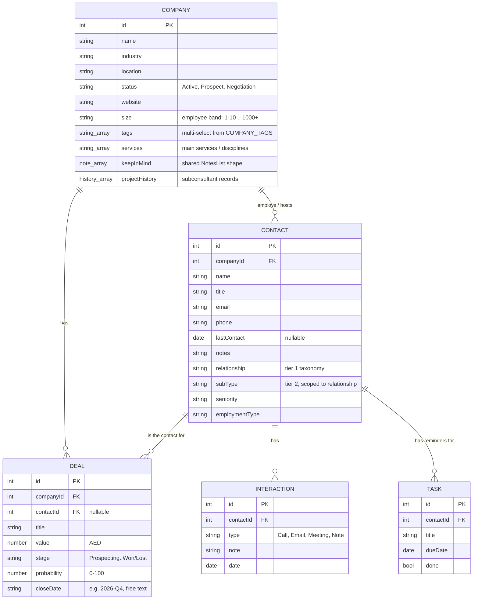

# ALSUWEIDI ERP — Specification

**Status**: Frontend-only UI proof-of-concept. No backend, no database, no persistence — every screen runs on in-memory React state seeded from dummy data.

**Why it's built this way**: the goal right now is management sign-off on look-and-feel and workflow *before* investing engineering time in a real backend. Everything documented here is the requirements gathered by building working UI and iterating on real feedback, not a spec written up front — treat it as the source of truth for what to build against once backend work starts.

If you're a developer, an AI agent, or anyone picking this project up cold: read this file first, then `README.md` for run/deploy instructions.

> **7 Jul 2026 night — THE EVERYTHING LIST sweep (Batches 16d + 18a–g).** The persona backlog in BACKLOG.md was built in one parallel pass. Shell-level additions (in `components/`): `NotificationsBell.jsx` (context provider in App + bell in every Navbar; feed composed live from lifted state), `GlobalSearch.jsx` (Ctrl+K palette: people, live projects, companies, contacts, RFPs, screens), `HomeWidgets.jsx` (My Week strip + management Company-KPI panel with board-pack print on the home page). Module additions: Finance gained Receipts / Petty cash / Payables / Retention / Month-end close / Activity views + credit notes and per-expense VAT; HR gained Appraisals / Training / Disciplinary / Exit interviews / Headcount & attrition / Grades & bands (`data/hrTalentData.js`); Marketing gained Campaigns / Approvals / Events / Awards / pack-usage log; the CRM RFP register gained bid-decision gate, tender checklists, bid cost, Competitors and Debriefs tabs; Office gained Meeting rooms / Supplies / Courier / Vehicles + Salik / Document numbering; IT gained SLA timers / Installed software / Maintenance / Access requests / System status; the PM workspace gained Transmittals / RFIs / Gate coordination / Photo report (4.21) / Safety log / Quick daily entry; Admin gained Authority & access (delegation-of-authority + visibility rules). Plus the 16d attendance punch drill-down and the 18a filter basics pass (~24 registers). Detailed per-view notes: STATUS.md "Latest".
>
> **11 Jul 2026 — Batch 20 (backlog cleared) + home page redesign.** The whole non-Phase-2 backlog shipped in one pass. New shared infrastructure: `components/SidebarNav.jsx` (the grouped module sidebar, used by all 8 module pages), `components/RegisterFilter.jsx` (`useRegisterFilter` hook + `RegisterFilterBar` — the search/status/date-range trio), `utils/id.js` (`nextId`), `utils/date.js` grew `fmtShortDate` + the single `daysUntil` (re-exported by pmData/crmData). **Finance state is lifted to App** via `state/financeState.js` — Home KPIs, PmDashboard, DMR/CMR and the workspace read live session invoices/expenses; **one audit log** via `state/auditLog.js` (canonical shape `{ts, user, module, kind, detail}`; Finance actions appear in Admin → Activity log, Finance → Activity is the module filter). Functional additions: auto-drafted 10% mobilization invoice on project creation, Billing-progress block on the project record (sensitive roles), P&L payroll line from HR employee gross, PRO dashboard (velocity/overdue/by-type + `doneDate` stamping), individuals-as-clients (`kind: 'individual'` on COMPANY — needs sign-off), leave denials stamp `decidedDate` not `approvedDate`. **Home page redesigned** ("launcher"): centered greeting + a search bar that opens the Ctrl+K palette (custom `open-global-search` event), one amber attention line composed from live personal load, module tiles with live one-line statuses, management KPI panel, news as three stock-photo media cards (`NEWS` in dashboardData; Unsplash placeholders with gradient+emoji fallback — the app's one external asset dependency) + an Upcoming Holidays card; carousel/quick-actions/mock team members removed.
>
> **13 Jul 2026 evening — Batch 23: PMO + Portfolio analytics + honest branding.** `components/projects/pm/PmoView.jsx` — the portfolio dashboard (Projects → PMO): RAG donut + big-number strip (clickable RAG filter), project tile grid (progress bar, worst SPI, late count, next milestone, billed-vs-fee bar, DPM/CPM initials, RAG border), person×4-week resource heatmap vs `CAPACITY_HOURS_PER_WEEK`, and a 30-day forward radar (claims via `claimDeadlines`, unsubmitted 4.21s, open milestones) as timeline strip + list. `scope` toggle All/Mine (Mine = user is DPM/CPM by `dpmId`/`cpmId` or on any `phase.team`). Money gated to `SENSITIVE_VIEW_ROLES`; health rules shared with Active projects (`projectHealth`). `components/projects/PortfolioAnalyticsView.jsx` **replaces** `ProjectsDashboard.jsx` (deleted) at the `dashboard` view key (sidebar label "Analytics"): computed sections (claims/NCRs by type, `hoursByDiscipline` toDate-vs-estim overruns, billing lag with earned-but-unbilled sum, supervision approved-vs-actual) + ILLUSTRATIVE-labelled Phase 2 shapes (duration slip, margin trend) awaiting the historical import. Branding: `BRAND_QUICK_GUIDELINES` reduced to sourced facts only (logo red/white; fonts + secondary palette marked "pending from Marketing" — the previous values were invented). Shell: `public/favicon.svg` (logo emblem, square-cropped viewBox), `<title>ALSUWEIDI ERP</title>`. Projects module sidebar (Sana's naming): My Work · PMO · **Active Projects** (tabs: Active projects [the Batch 11 dashboard, ex-"Management"] / Project reviews / Risk report) · Resources, then Database: **All Projects** (portfolio) · **Analytics**. The **per-project workspace sidebar** got the same grouping (~25 rows → ~15 on a D+S project): per phase Plan & progress (Tasks/Weekly updates/Schedule), Deliverables (Register/Transmittals), Design gates (Gates/Coordination), Site (Registers/RFIs/Safety log/Quick daily), Fees & cost, Team; contract admin → Claims & reports (Claims/Reports/Photo report), Authorities, Risks & meetings, Commercial & close-out (Payments/Handover/Site feedback). View keys unchanged everywhere; `helpData.js` step texts rewritten to the grouped navigation with new PMO/Analytics recipes.
>
> **13 Jul 2026 — Batch 22: IA restructure (intent-grouped sidebars + verb-first Finance actions).** Came out of Sana's "I feel lost in there / people are overwhelmed" conversation — the diagnosis was flat, equal-weight navigation (Finance had grown to 12 sidebar items, the HR workspace to 16). The pattern: **sidebar entries are now intent groups; the registers inside a group render as pill tabs** (new shared `components/SubViewTabs.jsx`). Old view keys are unchanged, so HelpHub deep-links (`location.state.view`) still land on the exact sub-view. Applied to: **Finance** (Overview / Money in [Invoices·Receipts·Retention] / Money out [Expenses·Payables·Petty cash] / Reports [P&L·Revenue·Accountant] / Close & activity [Month-end·Activity]), **HR workspace** (Inbox / Time & leave / Pay & planning / Performance / Exits / Compliance & admin — role gates preserved per view), **Office** (Documents & mail / Facilities / Registrations & licenses), **IT workspace** (Helpdesk [Queue·SLA·Access] / Assets & software [Assets·Licenses·Installed·Maintenance] / System status), **Marketing workspace** (Inbox / Content [Calendar·Campaigns·Approvals] / Showcase [Portfolio·Events·Awards] / Tools & insights [CV search·Analytics]), and **Admin Center** (Overview / Users & access [Users·Roles·Authority] / Oversight [Feedback·Activity log]). Badge counts roll up from tabs onto their group. Finance Overview additionally gained **four verb-first action cards** (Record an invoice / Log an expense / Record a payment / Petty cash entry) that jump to the register **with the add-form already open** (`initialAdd` prop on the four views + an `addIntent` flag in `Finance.jsx`, cleared on any manual navigation). CRM and Projects keep their existing labeled sidebar groups — they were already the pattern.
>
> **8 Jul 2026 — Batch 19: in-app Guide (help system).** `components/HelpHub.jsx` adds a `?` to every Navbar (beside search + bell) that opens a single help hub, contextual to the current module (`moduleForPath` maps the pathname). Three lenses — per-role orientation, ~50 "How do I…" task recipes (steps + a deep-link "Take me there"), and a module map — all from one file, `data/helpData.js`, maintained at module granularity. To make the deep-links land on an exact sub-view, every module page (Finance/CRM/IT/Marketing/Office/Admin/Projects) now reads `location.state?.view` at init **and** re-applies it via a `useEffect` on `location.key` (so a jump works even when you're already inside that module — a same-path navigation doesn't remount). Design decision: contextual `?` backed by module-level content rather than a per-page `?` with page-specific text (which would be a maintenance treadmill while screens still churn); per-field tooltips are deferred until screens stabilise.

---

## 1. Architecture

- **Frontend**: React 18 + Vite + Tailwind CSS + React Router. No backend, no API calls, no database.
- **State**: data lives in `useState` at the page level (`pages/CRM.jsx`, `pages/HR.jsx`, `pages/IT.jsx`, `pages/Marketing.jsx`, `pages/Admin.jsx`, `pages/Office.jsx`) and is passed down as props. Cross-module state is lifted to `App.jsx`: public holidays, projects, PM records, deals, marketing tasks, timesheets, staffing requests, system feedback, **finance state** (`state/financeState.js` hook — invoices/expenses/receipts/CNs/petty cash/payables/checklists plus all their actions, so Home KPIs, PM dashboards and the workspace read what the accountant edits), and the **app-wide audit log** (`state/auditLog.js` — canonical entry `{ts, user, module, kind, detail}`). Two other exceptions: portfolio packs live in a tiny `useSyncExternalStore` module store (`data/portfolioPacksStore.js`), and the timesheet reminder/lockout gate (`components/TimesheetGate.jsx`) wraps the whole app. Shared UI/utils introduced in Batch 20: `components/SidebarNav.jsx`, `components/RegisterFilter.jsx`, `utils/id.js` (`nextId`), `utils/date.js` (`todayISO`, `fmtShortDate`, `daysUntil`, `parseLocalDate`). Refreshing the page resets everything to the seed data in `data/*.js`. This is intentional for now — see §5.
- **Auth**: cosmetic only. Login is a name + role dropdown, no password, nothing sent anywhere. The `role` field **does** drive what renders (sensitive tabs, HR workspace, project financials — see role groups in §2), but purely client-side; anyone can pick any role — see §5.
- **Hosting**: [github.com/sanalogy-code/alsuweidi-erp-demo](https://github.com/sanalogy-code/alsuweidi-erp-demo) → Cloudflare Pages, auto-deploys on push to `master`.
- **Dependencies of note**: `lucide-react` (icons), `xlsx` (Excel/CSV export, lazy-loaded via dynamic `import()` so it doesn't bloat the main bundle — installed from SheetJS's own CDN build, not the npm registry package, which has two unpatched CVEs that don't apply to write-only usage but aren't worth shipping anyway).

### Local dev

Work from `C:\Users\sdiab\Projects\alsuweidi-erp-demo` on **local disk**. A separate copy at `G:\My Drive\Claude Projects\alsuweidi-erp-demo` exists but Google Drive's virtual filesystem makes `npm install`/`vite dev` unusably slow (it doesn't support the junctions/symlinks needed to bridge to local disk either) — treat that copy as stale/reference-only.

```
cd frontend
npm install
npm run dev      # local dev server
npm run build    # production build, also the fastest correctness check
```

---

## 2. Data Model

All entities are flat arrays with foreign-key-style ID fields, defined in `frontend/src/data/crmData.js` (CRM) and `frontend/src/data/hrData.js` (HR). This shape maps directly onto relational database tables — that was a deliberate choice so this translates cleanly to a real schema later.



### Company details (Batch 6; `kind` added Batch 20)

- `kind` — `'company'` (default) or `'individual'` (Batch 20 default build, pending Sana's sign-off): a private client is the same record with website/size hidden and an "Individual" chip in the list and detail modal. Toggle on the New-Client form. Seed: Khalid Al Marzooqi (private villa).
- `tags` — **multi-select** relationship tags from `COMPANY_TAGS`: `Client, Prospect, Subconsultant, Supplier, Partner, Government` (a company can be Client *and* Supplier at once — Gulf Steel Fabrication seeds that way). Tag + service filters on the Companies list. The entity keeps the name "Companies" per Sana's decision — the tags do the work a rename would have.
- `size` — employee band from `COMPANY_SIZES` (`1–10 … 1000+`); `website` — plain URL.
- `keepInMind` — "Keep in Mind" notes, `[{ id, text, date, author }]`. The same note shape is used by contacts (`keepInMind`) and projects (`lessons`) via the shared `NotesList` component.
- `projectHistory` — for Subconsultant-tagged companies: `[{ id, projectId (FK → PROJECTS), scope, note, date }]`, rendered as a "Project History" tab with an inline add form. Seeds: Apex Geotechnical Services, Lumina Lighting Studio.

### Portfolio packs (`data/portfolioPacksStore.js` + `PORTFOLIO_PACKS` in `marketingData.js`, Batch 6)

`{ id, category, fileName, uploadedDate }` — downloadable portfolio PDFs, managed by Marketing (Portfolio view), downloaded from CRM ("Portfolio PDFs" under Insights). Category is free-typed (extensible without code change); seeded Education / Data Center / Mixed Use / Communities / Industrial. Because Marketing and CRM are separate route trees, packs live in a tiny module-level store (`useSyncExternalStore`) instead of prop-threading through `App.jsx`. Downloads are demo stubs pending Phase 2 storage.

### Contact taxonomy (two-tier)

`relationship` is tier 1, `subType` is tier 2 and is scoped to a specific relationship. This mapping lives in `SUBTYPES_BY_RELATIONSHIP` in `crmData.js` and drives the cascading dropdown in the export filter (§3.5) — selecting a relationship narrows which sub-types are even selectable.

| Relationship | Valid Sub-Types |
|---|---|
| Client | Decision Maker, Technical Contact, Procurement, End User |
| Prospect | Cold Lead, Warm Lead, Referral |
| Vendor/Supplier | Subcontractor, Material Supplier, Software Vendor |
| Partner | JV Partner, Strategic Alliance |
| Government/Regulator | Regulator, Client Agency, Licensing Authority |
| Employee | Secondment, Site-Based, HQ |

`seniority` is one flat enum: `Entry, Senior, Manager, Director, VP, C-Suite` — deliberately matching the seniority tiers already used in the (not-yet-built) Marketing module's LinkedIn follower breakdown, so the same categorization is reusable across modules later.

`employmentType` is one flat enum: `Full-time, Part-time, Contractor, Consultant, Freelance` — describes the contact's employment status **at their own company**, not at ALSUWEIDI (except for `relationship: Employee` contacts, who are ALSUWEIDI staff embedded elsewhere, e.g. a site secondment).

### Deal stages

`Prospecting → Proposal → Negotiation → Won / Lost` (`STAGES` in `crmData.js`). `Won` and `Lost` are terminal. Pipeline value calculations generally exclude `Lost` (and often `Won`, when the question is "what's still open") — check each usage site, the exclusion isn't automatic.

### HR Employee model (`frontend/src/data/hrData.js`)

`EMPLOYEE` is a separate flat array, not (yet) related to the CRM entities above. Self-referential via `managerId` — root employees (department heads) have `managerId: null`; everyone else points to another employee's `id`, forming the org chart tree.

| Field | Notes |
|---|---|
| `id`, `name`, `title`, `dept`, `location`, `employmentType`, `email`, `phone`, `mobilePhone` | basic directory fields |
| `startDate`, `status` | tenure calc, active/inactive |
| `managerId` | FK to another `EMPLOYEE.id`, nullable — drives `OrgChart.jsx` and "Reports To" on the Info tab |
| `visa` | `{ status, expiryDate, sponsor, passportNumber }` |
| `dependents` | `[{ name, relationship, dob }]` |
| `accomplishments` | `[{ type, issuer, date, expiryDate }]`, `type` drawn from `ACCOMPLISHMENT_TYPES` |
| `emergencyContact` | `{ name, relationship, phone }` |
| `compensation` | `{ basicSalary, housingAllowance, transportAllowance, otherBenefits, noticePeriodDays }`, all AED/monthly except `otherBenefits` (free text) and `noticePeriodDays` |
| `contractEndDate` | drives the Renewals report alongside visa/passport/insurance expiries |

Since the passport/visa/EID split, employees and each dependent carry their own `passport` `{ number, country, type, issueDate, expiryDate }`, `visa` (null for UAE nationals), `emiratesId`, and (dependents) `insurance`.

Batch 5/6 additions: `workWeek` (key into `WORK_WEEK_PATTERNS` — Mon–Fri company default, Sun–Thu Jordan office, Mon–Sat site 6-day; auto-defaulted from employment type via `defaultWorkWeekFor`), and each entry in `documents` now carries a review status: `{ type, fileName, uploadedDate, status: pending|verified|rejected, reviewedBy, reviewedDate, rejectReason }` — HR verifies/rejects in `DocumentChecklist`; employees re-upload rejected docs from their own profile (seed: Priya Nair's degree certificate).

### Other HR entities (`hrData.js`)

| Entity | Shape / notes |
|---|---|
| `PUBLIC_HOLIDAYS` | `{ name, date, endDate?, status: approved\|pending, note }` — state lifted to `App.jsx` so HR approvals reach the Home tile in-session; Islamic dates stay pending until moon sighting |
| `LEAVE_REQUESTS` | `{ employeeId, employeeName, type, startDate, endDate, days, reason, status, requestedDate }` — **two-step approval (Batch 6):** `pending_manager → pending_hr → approved | denied`; `leaveStatusForNew()` starts at `pending_hr` when the employee has no manager. `requestedDate` is what queues sort by |
| `CERTIFICATE_REQUESTS` | `{ employeeId, employeeName, type (6 UAE letter types), addressedTo, language (En/Ar/bilingual), purpose, nocObject, status: pending\|issued\|rejected, letterText }` — `letterText` persists the issued letter; templates live in `data/certificateTemplates.js` |
| `COMPLAINTS` | `{ category, description, anonymous, submittedBy (null if anonymous), status: submitted\|under_review\|resolved }` — HR-staff-visible only |
| `OPEN_POSITIONS` / `CANDIDATES` | job board + pipeline; candidates are `kind: referral\|internal`, `status: new\|interviewing\|hired\|rejected` |
| `BUSINESS_CARD_REQUESTS` | `{ employeeId, employeeName, nameOnCard, titleOnCard, mobile, notes, status: pending\|fulfilled, requestedDate, resolvedDate }` — raised from My HR / My requests, fulfilled from the HR inbox ("Mark printed & delivered") |
| `PAYROLL_MONTHS` / `PAYROLL_ADJUSTMENTS` | per-month overtime/deduction adjustments layered on `compensation`; WPS run status draft → submitted → paid. **Batch 6 payroll logic:** offboarding cutoff (final month pro-rated to the last working day + end-of-service settlement line folded into that run, flagged "Final settlement"; employee drops off afterwards) and mid-month hire deferral (joining month pays nothing, banner explains; pro-rated catch-up lands on the *next* run as "Late pay catch-up") |
| `ATTENDANCE_TODAY` | illustrative snapshot (present/site/on_leave/absent, check-ins, weekly hours) — real feed is a Phase 2 backend item |

### Projects model (`frontend/src/data/projectsData.js`)

Modeled on the column structure of the company's existing ERP export (140 projects × 40 flat columns) but normalized: the old export flattens three records into one row, so half its columns are N/A for any project. Here a `PROJECT` is one core record plus **optional `design` and `supervision` sub-records** — scope-less sections simply don't exist. All seed projects are invented; no real client data was copied.

| Piece | Fields / notes |
|---|---|
| Core | `projectNo, name, employer, companyId (FK → CRM company, nullable), owner, type (Buildings/Infrastructure/Transportation/Secondment), mainFunction, location, sector (free text), plot, builtupArea, description, generalStatus (In Progress/On Hold/Completed), fund, contractType, contractSigned, loaObtained, contractorName` |
| Money (sensitive) | `contractValue` (fees) and `constructionCost`, AED — the real export strips these; here they're role-gated |
| People | `dpmId` / `cpmId` — FKs to HR `EMPLOYEES` |
| Stages | `stagesInvolved` (subset of the 9-stage pipeline: Data Collection → Concept → Schematic → Detailed → Tender Docs → IFC → Tendering → Construction → D&L) + `currentStage` — the old ERP stores this as a comma-joined string |
| `design` (nullable) | `{ sow: [disciplines from DESIGN_DISCIPLINES], status, outputFormat (CAD/BIM/CAD+BIM), startYear, completionYear, financialStatus (5-value incl. dispute states), payStatus }` |
| `supervision` (nullable) | `{ coverage (Full/Partial), status, payStatus, contractualCompletion, estimatedCompletion, approvedPct, actualPct, startYear, completionYear }` — approved vs actual is the behind-schedule signal |
| Marketing (Batch 3, absent = default) | `marketingDescription` (string\|null — client-facing portfolio copy, written by Marketing), `photosApproved` (bool — professional photography signed off), `confidential` (bool — hidden from portfolio; must be decided before stage advance since Batch 5). **A project cannot be marked Completed without description + approved photos.** |
| Portfolio fields (Batch 6, replaced the Proposal Builder) | `yearStarted` / `yearCompleted` (overridable; `yearStartedOf()` / `yearCompletedOf()` derive from design/supervision sub-records when unset), `images` (file-name-only list, Phase 2 storage placeholder), `specialFeatures` (free-form list), `lessons` (NotesList shape — Lessons tab on the record) |
| `photoWorkflow` (Batch 6) | `{ step: 0–3 index into PHOTO_WORKFLOW_STEPS (marketingData), photographer, notes }` — the 4-step photo task state: arrange photographer (external/in-house) → coordinate with Supervision → photos taken → review/approve/upload. Only the final step sets `photosApproved`. Seed: project 6 mid-flow |

### Project Management / project controls model (`frontend/src/data/pmData.js`, Batch 9)

Per-project PM registers keyed by `PROJECTS` id (`PM_RECORDS`; `getPmRecord()` returns an empty
skeleton for unseeded projects so every project opens a workspace). Built from PM_RESEARCH.md's
three verified pillars: document-centric review workflows (Aconex model), field & cost controls
(Procore model), and FIDIC contract administration. Seeds: projects 1 (full D+S, richest), 8
(supervision-only with an urgent claim-notice countdown), 5 (D+S), 2 (design-only, FIDIC 2017).

| Piece | Shape / notes |
|---|---|
| `fidicEdition` | per-project setting, `'1999'` default (Sana's decision) — drives claim cadences via `FIDIC_EDITIONS` (notice 28d both; detailed claim 42d/84d) |
| `team` | `[{ role (TEAM_ROLES: PD, DPM, CPM, RE, leads, inspectors…), employeeId (FK → EMPLOYEES, null = external/site staff), name }]` |
| `deliverables` | register: `{ docNo, title, discipline, rev (A/B/C…), status (draft → internal_review → issued → comments → revising → resubmit loop → approved/approved_as_noted, transitions in DELIVERABLE_NEXT), dueDate, history[] }` — resubmission bumps the rev, history preserved |
| `designStages` | 30-60-90-final gate reviews: `{ key, label, status (not_started/in_progress/passed), gateDate, notes }` — passing a gate opens the next |
| `wirs` / `mirs` | work/material inspection requests: WIR lifecycle contractor → RE → trade engineer → Approved / Approved-as-Noted / Resubmit, resubmitted under the **same WIR** with rev history |
| `ncrs` | `{ ref, date, priority, location, description, correctiveAction, status (open → ca_proposed → ca_approved → closed) }` — **closure requires an approved corrective action first** |
| `siteInstructions` | numbered SI register with cost/time impact flags (feed variations/claims) |
| `dailyReports` | manpower, plant, weather, work done, delays, HSE |
| `milestones` / `progressCurve` | baseline vs forecast/actual milestone bars with slip flags; monthly planned/actual % → S-curve + `spiOf()` (SPI = EV/PV at latest reported month) |
| `tasks` | project task list: assignee, due, overdue flags |
| `fees` | `{ manhourBudget, stages: [{ stage, fee, pctComplete }], variations: [{ ref, description, amount, status }] }` — earned = Σ fee × %; manhour actuals summed live from `TIMESHEETS` entries coded to the project; invoiced-vs-fee joined live from `INVOICES` |
| `claims` | FIDIC claims/EOT register: `{ ref, title, party, eventDate, awarenessDate, noticeDate, status (event_logged → notice_served → detailed_submitted → engineer_response → determined; time_barred), timeImpactDays, costImpact, records: [{ date, type: formal\|informal\|correspondence, note }] }` — `claimDeadlines()` computes the 28-day notice countdown from **awareness** (condition precedent) and the 42/84-day detailed-claim deadline from the notice; informal records logged deliberately (UAE Civil Code awareness evidence) |
| `reports` | monthly FIDIC 4.21 progress reports: due 7 days after month end, `REPORT_CHECKLIST_ITEMS` (progress/photos/personnel/QA/claims/safety/planned-vs-actual) must all be checked before "Mark submitted" |
| `authorities` | parallel authority workflows: `{ authority, type, portal (data, not code — Binaa/MEPS/TAMM keep changing), stages: [{ key, status (not_started → submitted → comments → resubmitted → approved), date }], cycles[] (submission history), notes }` — `AUTHORITY_TEMPLATES` provides Abu Dhabi-first profiles (DMT permit, ADCD fire track → Certificate of Conformity, 4-step utility NOC ladders, Estidama Pearl Design + Construction ratings, completion cert) and a Dubai secondary profile (BPS/DCD/DEWA/RTA/BCC). Timelines are user-entered, never hardcoded |

### Marketing model (`frontend/src/data/marketingData.js`, Batch 3)

| Entity | Shape / notes |
|---|---|
| `MARKETING_TASKS` | `{ type: marketing_description \| project_photos \| employee_headshot \| welcome_email, relatedKind: project\|employee, relatedId, relatedName, status: pending\|done, dueDate (nullable — execution times differ per type by design), notes, createdDate, completedDate }` — auto-created by cross-module events (state lifted to `App.jsx`), deduped to one open task per type per subject, assigned to all of Marketing |
| `CONTENT_ITEMS` | content calendar (reworked Batch 6): `{ copy (textarea — primary), media (file-name — primary), title (optional, "for reference"), type (6 CONTENT_TYPES), channel (CONTENT_CHANNELS: **Website / LinkedIn / Email only**), date, owner, status: idea → draft → pending_approval → approved → published, relatedProjectId (nullable FK), notes }` |
| `PHOTO_WORKFLOW_STEPS` | the 4 steps (key/label/hint/action) driving the project-photos task workflow — state lives on `project.photoWorkflow` |
| `PORTFOLIO_PACKS` | see Portfolio packs above (CRM section) — seeded here, served via `portfolioPacksStore.js` |
| `BRAND_ASSETS` | branding library (visible to everyone, overhauled Batch 6): `{ name, category (Logos/Fonts/Templates/Guidelines/Stationery/Photography), format, sizeLabel, updatedDate, description }` — Arabic logo removed; Symbol/Primary/Vertical logos each in full-colour + reversed; Arabic + English font assets; Brand Guidelines + Platform & Narrative Guide docs. `BRAND_QUICK_GUIDELINES` backs the new default "Quick guidelines" view. Downloads mocked until Phase 2 storage |
| `LINKEDIN_STATS` / `WEBSITE_STATS` | mock analytics feeds (follower seniority reuses the CRM seniority tiers); proposal win rate is computed live from CRM deals instead |

### Timesheets model (`frontend/src/data/timesheetData.js`, Batch 4)

`TIMESHEETS`: `{ employeeId, employeeName, weekStart (Sunday ISO), entries: [{ code: PROJECTS id | OVERHEAD_CODES code, hours: [7 numbers Sun..Sat] }], status: draft → submitted → approved | rejected, submittedDate, approvedBy, approvedDate, rejectReason }`. `OVERHEAD_CODES` (Batch 6) = Admin, IT, Marketing, General, Leave, Training — replacing the old general/leave/training buckets; the entry column is labelled "Project / overhead". The grid respects each employee's `workWeek` pattern (Batch 5): weekends shade per person, and `lastWorkingDayIndex(workWeek)` drives the reminder timing. Helpers (`weekStartOf`, `fmtWeekRange`, `timesheetTotal`, `toLocalISO`) live in the same file.

**TimesheetGate** (Batch 6, app-level component `components/TimesheetGate.jsx`): for any login mapping to an employee with timesheet history — a reminder banner on the employee's own last working day when this week isn't submitted, and a full-screen lockout modal on every page when *last* week is unsubmitted ("Fill timesheet now" deep link + a "demo: dismiss" escape hatch). Demo: "Fatima Al Mansouri" (lockout — stuck draft), "Osama Hussain" (Friday reminder).

### Role groups (`dashboardData.js`)

Batch 6 added two roles: `it` (IT department) and `adminstaff` (office administration — employee-level access only, no sensitive data). The full role → workspace matrix is documented in a comment in `dashboardData.js`.

`HR_STAFF_ROLES = ['hr', 'admin']` (process requests: inbox, certificates, complaints, holidays, business cards, document review). `SENSITIVE_VIEW_ROLES = ['hr', 'admin', 'management']` (view sensitive data: visa/dependents/compensation tabs, renewals, payroll, attendance, leave planner, timesheet oversight, project financials). `IT_VIEW_ROLES = ['it', 'admin', 'management']` (IT workspace — Batch 6; HR staff no longer piggyback). `MARKETING_VIEW_ROLES = ['marketing', 'management', 'admin']` (Marketing workspace — everything except Branding, which is visible to everyone). `FINANCE_VIEW_ROLES = ['management', 'admin']` (Batch 7 — the whole Financials & Accounting module is sensitive; other roles get a "Restricted module" screen and the home tile is hidden). `ADMIN_VIEW_ROLES = ['admin', 'management']` (Batch 8, lives in `adminData.js` — the Admin Center, same gating pattern as Finance). Separately from role groups, anyone with direct reports (`managerId` links) gets Team timesheets and Team leave approval views. Client-side gating only — see §5.

### Admin model (`frontend/src/data/adminData.js`, Batch 8)

| Entity | Shape / notes |
|---|---|
| `USER_ACCOUNTS` | `{ id, name, email, role, employeeId (FK → EMPLOYEES, null for system/external accounts), status: active\|invited\|disabled, createdDate, lastLogin, logins30d, note?, disabledReason? }` — seeded to mirror the HR employee seeds plus Sana (system admin), the PRO company, and one pending invite |
| `DEFAULT_PERMISSIONS` | role × module access matrix (`none\|view\|full` per `PERMISSION_MODULES` key) — **mirrors the app's actual client-side gates** (`*_VIEW_ROLES` + per-view checks) and doubles as the Phase 2 RBAC spec. Keep in sync when a gate changes |
| `AUDIT_LOG` | mock audit trail: `{ ts, user, module, kind: login\|create\|update\|approve\|reject\|delete\|access_denied\|export, detail }` — entries reference real seed events across modules |
| `MODULE_USAGE_30D` | mock 30-day sessions per module for the usage bars |

---

## 3. Feature Map

### CRM (`pages/CRM.jsx`, all state owned here and passed down)

Grouped **sidebar navigation** (same pattern and visual language as HR — replaced the old six-tab bar): **Overview** top-level, then **Sales** (Pipeline, Companies, Contacts), **My Work** (Tasks, badge = open tasks due today or overdue), **Insights** (Reports, Portfolio PDFs). Sidebar collapses to a wrapping horizontal row on mobile (`sm:flex-col`), group labels hidden.

1. **Overview** (`OverviewView`) — dashboard: stat cards (companies, open pipeline value, weighted expected value, needs-follow-up count, tasks-overdue count), plus widgets: Needs Follow-Up (contacts untouched 14+ days — names clickable since Batch 6, opening the contact detail modal), Reminders (tasks due within 7 days), Closing Soon (deals by close date), Top Clients by value, Pipeline by Stage breakdown.
2. **Pipeline** (`PipelineView`) — Kanban board by deal stage. Drag-and-drop or per-card dropdown to change stage. **Unified date range selector:** preset dropdown (All Time / This Year / This Quarter / This Month) or custom date picker (From/To dates). Filters respond in real-time. Handles ISO dates, quarter format (2026-Q3), and year format (2026). Edit button (pencil icon) on each card opens `DealEditModal` (edit title/value/stage/probability/close date, or delete with confirmation). Summary bar: open pipeline, weighted expected, won total, win rate.
3. **Companies** (`CompaniesView`) — searchable list with **relationship-tag and main-service filters** (Batch 6), tag chips per row + detail drill-down (Contacts / Deals / Activity tabs, plus **Project History** for Subconsultant-tagged companies and **Keep in Mind** notes via shared `NotesList`). Edit button in company header opens `CompanyEditModal` (name/industry/location/status + website/size/tags/services, or delete with confirmation). Activity tab shows real logged interactions.
4. **Contacts** (`ContactsView`) — searchable directory. Click name → `ContactDetailModal` (info, inline edit, linked deals, full interaction history, Keep in Mind notes, quick actions). "Export" button → `ExportContactsModal` (filters + live preview + Excel/CSV export, client-side).
5. **Tasks** (`TasksView`) — reminders tied to contacts, grouped Overdue / Due This Week / Later / Done.
6. **Reports** — **Redesigned:** Unified date range selector (same as Pipeline: presets + custom picker). Shows two views filtered by the same date range: Monthly Breakdown (aggregated by month) + All Deals list (individual deal rows with company, title, value, stage, probability, close date). Company/Stage filters inline. One-click Excel CSV download includes both views + summary. Handles all date formats.
7. **Portfolio PDFs** (Batch 6, under Insights) — downloadable portfolio packs grouped by category, fed live from the packs Marketing manages in its Portfolio view (shared `portfolioPacksStore.js`). Downloads are demo stubs pending Phase 2 storage.

Shared modals: `Modal.jsx` (base — supports `wide` and `layered` variants; `layered` bumps z-index for modals-within-modals, e.g. Log Interaction from Contact Detail renders on top).

### HR (`pages/HR.jsx`)

Grouped **sidebar navigation with two lenses** (replaced the old flat tab bar, which had grown to 11 tabs). Employees see self-service; HR staff additionally see an "HR Workspace" group; management sees the workspace minus Inbox and Holidays (complaint handling is HR-only). **Since Batch 22 the workspace is six intent groups** — Inbox / Time & leave / Pay & planning / Performance / Exits / Compliance & admin — with the individual registers as pill tabs (`SubViewTabs`), each view keeping its original role gate.

**Everyone:**

1. **My HR** — personal hub: action cards (Request leave with own remaining balance, Request certificate, Raise a concern, My requests count), next approved public holiday, org-wide stat cards for privileged roles, HR callouts (inbox count, renewals due), onboarding banner for new hires. The logged-in user is matched to an employee record by name.
2. **People** — one view, four toggles: **List** (`EmployeeList`), **Org Chart** (`OrgChart`, recursive tree from `managerId`), **Accomplishments** (`AccomplishmentsSearch`, "who has a PE license?"), and **CV search** (`CvSearch`, HR staff only — Batch 3, shared component with the Marketing module: keyword/department/accomplishment filters, headshot-on-file flag). Click any person → `EmployeeDetailModal`:
   - **Info:** employment details, nationality, "Reports To" (clickable), emergency contact — visible to all
   - **Accomplishments:** visible to all; employees can add their own entries (flagged "Pending HR verification" until HR verifies — HR-added entries are pre-verified)
   - **Visa & Dependents / Documents:** `SENSITIVE_VIEW_ROLES` **or the employee's own record** (`isSelf` carve-out, Batch 2 — self-service covers "when does my visa expire?"). Full passport/visa/EID per person and per dependent, dependent insurance, add-dependent form; typed documents via `DocumentChecklist`
   - **Compensation:** `SENSITIVE_VIEW_ROLES` only — no self exception. Salary package, notice period, probation + guaranteed increment
   - HR staff also get an **Add employee** button on People (`AddEmployeeModal`, Batch 2) — direct entry for walk-ins/transfers/back-fills: personal side editable by HR, employment side shared with the new-joiner review (`EmploymentRecordFields`), required documents enforced before creation
3. **My timesheet** (`MyTimesheet`, Batch 4; faster entry Batch 6) — weekly project-linked timesheet: Sun–Sat grid with the employee's *own* weekend shaded (work-week patterns, Batch 5), hours per project code per day plus overhead codes (Admin/IT/Marketing/General/Leave/Training) under a "Project / overhead" column, save draft / submit week, week navigation, "My recent weeks" history. **"Copy last week"** pre-fills rows + hours; a blank week defaults to last week's project rows with empty hours. Rejected weeks reopen editable with the reason. Home's "Fill Timesheet" quick action deep-links here. Requires a name-matched employee record. App-wide, `TimesheetGate` adds the last-working-day reminder banner and the unsubmitted-last-week lockout modal (see §2 Timesheets).
4. **My requests** (`MyRequests`) — the employee's own leave + certificate + concern + **business card** (Batch 6: name/title as on card, mobile, notes) submissions in one filterable list with status chips. Leave shows the two-step chain state ("Awaiting manager (1/2)" / "Awaiting HR (2/2)"). Anonymous concerns are deliberately not tracked here.
4. **Careers** (`CareersTab`) — open positions with referral bonuses; refer a candidate or apply internally; HR sees and advances the per-role pipeline (New → Interviewing → Hired/Rejected).
5. **Onboarding** (`OnboardingChecklist`) — only when the user checked "I'm a new hire" at login. 7 sections + acknowledgement gate.

**HR Workspace (role-gated):**

6. **Inbox** (`HRInbox`) — the HR work queue: pending leave (only manager-approved or no-manager requests since Batch 6), pending certificates, **business card requests** ("Mark printed & delivered" fulfil), open concerns, new candidates, and pending new-joiner profile submissions in one list, oldest first, fixed-width scannable columns (Batch 5 house style), actioned inline. Recently issued letters listed below. Badge = queue size.
7. **Leave planner** — toggle between `LeaveDashboard` (month timeline of who's off, same-team overlap warnings, holiday/weekend shading per employee work week, annual balances at 30 days) and `LeaveRequestsList` (full history + approve/deny). **Leave approval is a two-step chain (Batch 6):** manager first (`pending_manager` — anyone with direct reports gets a "Team leave" view + badge), then HR (`pending_hr`); HR steps in directly when the employee has no manager.
8. **Renewals** (`RenewalsReport`) — everything expiring within 90 days or overdue: visas, passports, contracts (`contractEndDate`), dependent insurance — employees and dependents both. Also surfaced as a My HR callout.
9. **Attendance** (`AttendanceTab`) — today's snapshot (in office / on site / on leave / absent), check-ins, weekly hours, late/absence counts. Fingerprint feed is Phase 2; data is illustrative.
10. **Payroll** (`PayrollTab`) — monthly WPS run: basic + allowances + overtime − deductions per employee, month selector, run status (Draft → Generate WPS SIF → Submitted → Paid), payslip modal per employee incl. estimated end-of-service gratuity (21 days basic/yr first 5 years, 30 after). **Day 3 addition:** card showing pending referral gifts queued for the current payroll run. **Batch 4:** amber banner counting employees with unsubmitted timesheets for last week ("unsubmitted blocks payroll" per policy — display-only flag, real enforcement Phase 2) with a jump link to Timesheets. **Batch 6:** offboarding cutoff (final month pro-rated to last working day + end-of-service settlement folded in, "Final settlement" flag on row + payslip — demo: Aug 2026, Ahmed El Haddad) and mid-month hire deferral/catch-up (joining month pays nothing with an explanatory banner; catch-up line on the next run — demo: Priya Nair, Jun deferral / Jul catch-up).
10b. **Timesheets** (`TimesheetApprovals`, Batch 4/5, `SENSITIVE_VIEW_ROLES`) — company-wide oversight since line-manager approval (Batch 5): anyone with direct reports gets a **"Team timesheets"** view and approves their own team; HR's view shows who each week is awaiting ("awaiting <manager>" or "HR (no line manager)") and can step in. Expandable per-day/per-code breakdown, approve / reject-with-reason (week reopens), missing-list for last week (drafts count as missing).
11. **Holidays** (`HolidaysTab`, HR staff only) — approve/edit/add public holidays; approved ones feed the Home dashboard tile and the leave calendar shading.
12. **Offboarding** (`OffboardingTab`, HR staff only) — reason, last working day, exit interview date/notes, 8-item leaver checklist (notice/handover/exit-interview/IT-assets/access-revocation/visa-cancellation/settlement/experience-cert). Checklist auto-completes the offboarding record.
13. **Staff planning** (`StaffPlanningTab`, management only) — hires needed per upcoming project (live or pipeline), role, headcount, needed-by date, status tracking. Urgency warnings for roles needed within 45 days.
14. **PRO tasks** (`ProTasksView`, HR staff only) — queue for the PRO company: new work-permit, visa stamping/renewal/cancellation, EID tasks. Status progression (Open → In Progress → Done), progress notes per task, document uploads (mocked file names, real storage Phase 2). PRO company sees only this queue when logged in (no employee data, no HR workspace access).

**New-employee registration** (Day 3 feature):
- **Self-service wizard** (`NewJoinerWizard`) — 4-step form (Personal/Qualifications/Documents/Bank & family) only new hires see. Step-by-step validation: required fields, required documents (visa page auto-hidden for UAE nationals), no submission until all met.
- **HR review & completion** (`NewJoinerReviewModal`) — opened from Inbox when a joiner submission arrives. Left side: everything the employee submitted (documents, qualifications, bank details). Right side: HR completes the employment record. **Auto-fill policy defaults:** selecting a designation auto-fills department, seniority, and work-permit title; selecting employment type auto-fills probation, notice period, severance policy, leave basis from a policy-defaults table — HR only overrides exceptions. Approval creates the employee record in People. The employment form + record-building live in `EmploymentRecordFields.jsx` (shared with `AddEmployeeModal` since Batch 2).
- **Probation increments** (`EmployeeDetailModal`, Compensation tab) — guaranteed salary increment shown at hire, applied after probation (surfaced on My HR as "Probation ending soon" card if < 60 days away).
- **Referral gifts** (`CareersTab`, `PayrollTab`) — flat AED 500 gift auto-awarded when a referred candidate is hired, queued on the payroll run with the referrer's name.
- **Typed documents** (`DocumentChecklist` component, shared across new-joiner wizard + employee records + project records) — every document declares its type; required documents (passport/photo/degree for joiners, LOA for projects) block submission/creation. **Batch 6: per-document review status** — pending / verified / rejected chips; HR verifies or rejects with a reason, employees re-upload rejected docs from their own profile. Files are name-only for now; real Phase 2 storage pending.

**Certificate letters** (`CertificateLetterModal` + `data/certificateTemplates.js`): six UAE letter types (salary, employment, salary transfer, NOC, embassy, experience) with suggested wording auto-filled from the employee record in English/Arabic/bilingual; HR edits freely, prints to PDF on letterhead (hidden-iframe print), Zoho Sign step is a mocked workflow preview pending the Phase 2 backend.

### Projects (`pages/Projects.jsx`)

Sidebar: Dashboard, Portfolio, **Resources** (Batch 9). Each project record now links into a
full **Project Workspace** (see below).

1. **Portfolio** (`ProjectList`) — deliberately the anti-CSV: seven columns (no, name + client, type, scope, current stage, DPM/CPM, status) with type/scope/status/location filters, search, and a "My projects" toggle (matches the logged-in name against DPM/CPM). Everything else lives in the drill-in.
2. **Project record** (`ProjectDetailModal`) — header with status chip and the 9-stage pipeline as a visual strip (`StagePipeline`; out-of-scope stages muted). Tabs render conditionally:
   - **Overview** — always; description, function, contract type, fund, sector/plot/area, contract & LOA state, contractor. **Batch 3:** a "Marketing sign-off" panel shows the marketing description (read-only here — Marketing owns it) and the description/photos gate status. **Batch 6:** years started/completed (derived or overridden), images (file-name-only) and special features — all editable in the Edit modal
   - **Lessons** (Batch 6) — lessons-learned notes on the project via shared `NotesList` (text + date + author, inline add)
   - **Design** — only if the project has design scope; discipline chips, output format, years, scope status
   - **Supervision** — only if supervised; coverage, contractual vs estimated completion (late dates in red), approved-vs-actual progress bars with a "N pts behind plan" flag
   - **Financials** — `SENSITIVE_VIEW_ROLES` only; contract value, construction cost, design fee financial status (disputes highlighted), payment statuses
   - **Team** — DPM/CPM open the full HR `EmployeeDetailModal` (cross-module); employers matching CRM companies get a "CRM client" tag
   - **Documents** — typed project documents (LOA required, contract/proposal/NOCs/drawings/other optional). Files are name-only; real storage Phase 2.
3. **Won deal → project creation** (`CreateProjectFromDealModal`) — when a CRM deal reaches `Won`, the Overview card shows "Create project"; the modal lets you pick scope (Design only / Supervision only / Design + Supervision), stages involved, and **requires attaching the LOA before creation** (enforced via required-document gating). Created project inherits the deal's employer as companyId. The scope→stages mapping (`STAGES_BY_SCOPE`) lives in `projectsData.js`, shared with direct creation.
4. **Direct creation / edit / advance** (Batch 2):
   - **New project** (`NewProjectModal`, sidebar button) — for direct awards and tenders that didn't come through CRM. Same LOA requirement; auto-numbers from the highest existing `projectNo`.
   - **Edit** (`EditProjectModal`, header button on the record) — core fields, status, DPM/CPM, contract-signed flag; contract value and construction cost only render for `SENSITIVE_VIEW_ROLES`. Scope/stage structure is deliberately not editable here. **Batch 3 completion gate:** setting status to Completed is blocked unless the project has a marketing description AND approved photos — the blocked attempt explains why and auto-queues the missing tasks in Marketing's inbox.
   - **Stage advance** — back/forward controls under the pipeline strip, constrained to `stagesInvolved`. **Batch 3:** advancing into the final stage auto-queues a `project_photos` task for Marketing (photography blocks completion later).
   - **Supervision progress** — "Update" on the Supervision tab edits approved/actual % inline (clamped 0–100); behind-plan flag recalculates.
5. **Resources** (`ResourcesView`, Batch 9) — portfolio-level person × project allocation: assignments derived from PM team panels + DPM/CPM links on active projects, load % illustrative (green <80%, amber 80–100%, red over-allocated). Standard pattern per Sana's decision — she corrects against real staffing practice on screen.

### Project Management (Batches 9–15 — built in one day against Sana's live review of the current ERP)

> **The authoritative quick description of Batches 10–15 lives in [STATUS.md](STATUS.md)** (each
> batch has a dated entry). Summary of what changed after the §-below was written for Batch 9:
> - **Phases (B10):** a PM record is now `phases: []` (design / supervision / study), each with own
>   team, tasks, schedule, fees, weekly updates, and phase-appropriate registers; claims/reports/
>   authorities stay project-level. `Study / Advisory` scope added (TIS/surveying; seed P-2725).
> - **PM state lifted to `App.jsx`** (`pmRecords`, `allocations`) — edits survive navigation.
> - **Projects page split (B11):** *Project Management* (My Work — default landing, Management
>   dashboard with RAG health, Project reviews, Resources) vs *Database* (Portfolio, Record stats).
>   Clicking a project opens its workspace; the record card is behind "Details".
> - **Plan & tasks (B11):** per-project `method` — waterfall (Gantt timeline, late-in-red,
>   milestone diamonds) or sprints (`pm.sprints`, board + backlog). Tasks carry
>   start/due/effort/% complete/priority/checklist/comments.
> - **Governance (B12):** `risks`, `meetings` (actions feed My Work), `ipcs`, `handover`
>   (snags gate TOC → DLP → Performance Certificate) per project; person × week **resource
>   planner** (`INITIAL_ALLOCATIONS`, 40h/wk capacity) with a Months utilization rollup (B14).
> - **Project reviews (B13/14):** Design review (weekly, ex-DMR — `hoursByDiscipline` vs R0
>   estimate, profitability A–G at blended AED 210/h, financial waterfall, notes composed from
>   registers) + Construction review (monthly, ex-CMR — `phase.cmr` facts, deployment, photos).
> - **Absorbed current-ERP screens elsewhere (B14/15):** CRM `Proposals (RFPs)` register
>   (`data/rfpData.js`, linked to companies + delivery projects); HR Attendance **Period report**;
>   HR **Timesheet insights** + Workload review; Finance **Revenue reports**; Admin
>   **Registrations & licenses** expiry radar (CFPE/ADCD 1-Sept-2026 gate seeded).
> - Standing design rule from Sana: **absorb the current ERP's information, never its design**,
>   and link data across modules instead of standalone screens.
> - **Batches 16a–c (7 Jul):** tasks gained `parentId` subtasks (nested rendering, parent %
>   roll-up), `dependsOn` dependencies (blocked chips/locks, amber Gantt bars), milestone
>   add/edit/achieve on the Plan view, and **Log hours → timesheet** (App.logTaskHours writes
>   into the assignee's weekly timesheet, draft/new weeks only). `pm.constructionFeedback` =
>   the Site feedback register (issue type/impact/reason/improvement, open → with_design →
>   completed, push-to-Lessons). `rfpData.INITIAL_STAFFING_REQUESTS` + App state = pipeline
>   staffing requests (raised on RFPs, accepted/declined in HR Staff planning's intake).
>   7 Jul morning: Office Administration module (`/office`, adminstaff workspace:
>   correspondence register with auto IN/OUT refs, registrations & licenses moved there),
>   per-user SPECIAL ACCESS overrides in Admin Users (module + view/full + expiry).
> - **Batches 17a–b (7 Jul, Sana's visibility pass — "I need to SEE tasks"):** tasks render as a
>   sortable aligned-column **TaskTable** (`TaskTable.jsx`, shaded container; sort by
>   date/priority/status/assignee/assigned-by; rows expand to the full editing card) — the default
>   lens on each phase's Plan & tasks, with a real side-by-side kanban **Board** (compact cards)
>   one click away; project-level **All tasks** view (`AllTasksView.jsx`) aggregates every phase
>   with search + filters. Tasks record `createdBy` at creation (display falls back to the phase
>   lead). Portfolio **Risk report** (`RiskReportView.jsx`, Projects nav) — severity = P×I,
>   projects sorted worst-first, plus a what's-bad strip atop each project register. Meetings
>   carry free-text `notes` ("what was discussed"). **Gantt** gained a month scale (labels +
>   gridlines, domain = tasks + unachieved milestones only). **`pm.method` is now a setup-time
>   choice** (picker on NewProjectModal → `project.method` → `emptyPmRecord`; PlanView shows a
>   fixed chip, change behind a confirm). **Management dashboard** adds Labour-cost stat +
>   per-project Cost (hours × AED 210) and Invoiced/fee columns (sensitive roles only). Default
>   demo login = Samir Al Mazrouei / management (his 28-Jun week seeded submitted → no lockout).
> - **7 Jul code review (medium) over the Batches 9–15 diff: 8 confirmed findings, ALL FIXED
>   the same night** — see
>   BACKLOG.md "Code review findings" for the ranked list (top items: PmOverview leaks fee data
>   to ungated roles; its "Fee invoiced" card jumps to a view that doesn't render; the PM module
>   reads the static TIMESHEETS seed instead of App's lifted state). Fix before building Batch 16
>   features. Known cleanup: UTC `todayISO` ×8, duplicate `daysUntil` semantics, dead
>   ResourcesView.jsx.

### Project Workspace (`pages/ProjectWorkspace.jsx` at `/projects/:id`, Batch 9, data in `data/pmData.js`)

The full project-controls module from PM_RESEARCH.md — opened via the "Project workspace" button
on the project record modal. Header: project identity + status + the 9-stage pipeline strip.
Sidebar sections render by scope (design-only projects get no Site section; supervision-only get
no Design stages) with live badges (open site items, open tasks, claim-deadline alerts, reports
due). Registers live in page state seeded per project from `PM_RECORDS`; edits last the session.

1. **Overview** (`PmOverview`) — claim-deadline alert banners (28-day notice / detailed-claim countdowns — red when overdue, amber ≤10 days), monthly-report due banner, and stat cards jumping to each register: SPI, open inspections (WIRs + NCRs), deliverables in flight, open tasks, claims, fee-invoiced % (live from `INVOICES`), authority workflows awaiting response, FIDIC edition.
2. **Deliverables** (`DeliverablesView`) — the register with per-revision history and the review workflow (internal QA → issue → client comments → revise → resubmit as next rev → approved / approved-as-noted); register new deliverables inline.
3. **Design stages** (`DesignStagesView`) — 30-60-90-final gate list with pass-gate action (opens the next gate); design-scope projects only.
4. **Site** (`SiteView`) — five tabs: **WIRs** (RE → trade-engineer decisions, resubmit keeps the same reference with rev history), **MIRs** (approve/reject), **NCRs** (propose corrective action → approve CA → verify & close — closure blocked without an approved CA), **Site instructions** (issue with cost/time-impact flags, mark actioned), **Daily reports** (read-only log).
5. **Schedule** (`ScheduleView`) — planned-vs-actual S-curve (SVG) with SPI chip, milestone bars baseline-vs-forecast/actual with slip flags. Full CPM deliberately out of scope.
6. **Tasks** (`PmTasksView` + `TaskTable`/`AllTasksView`, Batch 17) — table lens by default (aligned sortable columns: task, status, priority, assigned to, assigned by, due; rows expand to the full card), kanban board lens (To do / In progress / Done columns, compact cards), subtasks/dependencies/log-hours on the card; sidebar-level **All tasks** shows every phase's tasks in one filterable table.
7. **Fees & cost** (`FeesView`, `SENSITIVE_VIEW_ROLES` only) — fee by stage with editable % complete + EAC, earned vs invoiced, manhour budget vs live timesheet actuals (entries coded to the project), variations register, and the project's invoices joined from Financials.
8. **Claims & EOT** (`ClaimsView`) — the FIDIC register: per-claim deadline countdowns, status chain actions ("Mark notice served today" → detailed claim → engineer response → determined), contemporary-records log with formal/informal/correspondence typing, log-event form (starts the notice clock from the awareness date), per-project FIDIC edition selector.
9. **Progress reports** (`ReportsView`) — monthly FIDIC 4.21 checklist; submission blocked until all required contents are checked; 7-days-after-month-end due tracking.
10. **Authorities** (`AuthoritiesView`) — parallel authority workflows with sequential stage actions (submit → comments → resubmit → approved) and a submission-cycle history; add-workflow picker from the Abu Dhabi / Dubai emirate template profiles.
11. **Team** (`TeamView`) — role-tagged team panel; HR-linked members open `EmployeeDetailModal`, external/site staff are name-only; add/remove inline.

### IT & Assets (`pages/IT.jsx`, Batch 2, data in `data/itData.js`)

Home tile + `/it` route. Everyone gets **My requests** (`ItRequestsView` in `mine` mode) — raise hardware / software-license / repair / access requests. `IT_VIEW_ROLES` (it / admin / management — Batch 6; HR staff no longer have access) get the **IT Workspace**:

1. **Request queue** (`ItRequestsView` in `queue` mode) — pending-first list of all requests; approve (with note) → mark fulfilled, or reject with a reason. Status enum: pending / approved / fulfilled / rejected.
2. **Assets** (`AssetRegistry`) — tagged registry (`IT-0031`…): type, model, serial, purchase date, book value, notes; inline assignment dropdown (assign → `in_use`, unassign → `in_stock`) and status dropdown (in use / in stock / repair / retired); add-asset form auto-numbers the tag; header shows active book value. Offboarding's IT-assets checklist item is the manual cross-check against this list.
3. **Licenses** (`LicensesView`) — software subscriptions with seats used/total (full seats flagged), yearly cost, and renewal radar: within 60 days amber, overdue red, callout card when anything is due. **Batch 6:** "Add license" button + form (name, vendor/owner, seats, yearly cost, renewal date), same pattern as Add asset; new licenses get the 60-day radar automatically.

Data: `IT_ASSETS` (assignedToId FK → HR `EMPLOYEES`), `SOFTWARE_LICENSES`, `IT_REQUESTS`, plus `ASSET_TYPES`, `ASSET_STATUS`, `IT_REQUEST_TYPES`, `IT_REQUEST_STATUS` enums.

### Marketing (`pages/Marketing.jsx`, Batch 3, data in `data/marketingData.js`)

Content sits *inside* Marketing (the separate "Content" home tile was removed). The workspace is `MARKETING_VIEW_ROLES` only; **Branding is the exception — visible to every employee**. Marketing-task state is lifted to `App.jsx` because other modules feed the inbox.

1. **Inbox** (`MarketingInbox`) — one queue of everything waiting on Marketing, oldest first, badge on the nav, fixed-width scannable columns (Batch 5 house style). Auto-fed: **project created** (any path — CRM won-deal or direct) → `marketing_description` task; **project reaches final stage or a completion attempt is blocked** → `project_photos` task; **employee record created** (direct entry or approved joiner) → `employee_headshot` + `welcome_email` tasks. Actions inline: description editor modal (shows the PM's technical description for reference, saves to the project, completes the task), headshot mark-done, and a welcome-email designer (prefilled draft; completing hands it to HR, who check and send — Marketing never sends directly, per decision). **The photo task is a 4-step workflow (Batch 6):** arrange photographer (external / in-house modal) → coordinate with Supervision before handover → photos taken → review/approve/upload; state persists on `project.photoWorkflow`; only the final step sets `photosApproved` and satisfies the completion gate.
2. **Content calendar** (`ContentCalendar`, reworked Batch 6) — month grid (items as status-colored chips) + list in house-style columns, **Month vs custom From/To range selector** (CRM Pipeline/Reports pattern), add/edit modal where **copy (textarea) and media (file-name) are the primary fields** — title optional, "for reference" — channels fixed to Website / LinkedIn / Email, optional related project, and the status workflow idea → draft → pending approval → approved → published, advanced inline.
3. **Portfolio** (`PortfolioView`) — Marketing's lens on the project list: free-text search + industry/area/scope/status/readiness filters (Batch 5), portfolio-readiness per project (**ready** = description + approved photos + not confidential), stat cards, write/edit descriptions (auto-completes any open description task), per-project portfolio fields (years, images, special features — Batch 6), confirm-guarded confidentiality toggle, and **Portfolio packs management** (Batch 6): upload/remove category-grouped portfolio PDFs that surface in CRM's "Portfolio PDFs" view.
4. ~~**Proposal builder**~~ — **deleted in Batch 6** (Sana's decision): its useful fields moved onto the project record (years, images, special features) and the pre-assembled portfolio packs replaced the pack-building flow.
5. **CV search** (`CvSearch`, shared with HR People) — keyword / department / accomplishment filters over active employees, accomplishment chips, headshot-on-file indicator.
6. **Analytics** (`MarketingAnalytics`) — proposal win rate computed **live from CRM deals** (won vs lost); portfolio-ready count; content pipeline by status; LinkedIn follower/seniority and website top-pages panels are labelled mock feeds pending Phase 2 integrations.
7. **Branding** (`BrandAssetsView`, everyone; overhauled Batch 6) — **Quick guidelines** is the default view (logo / font / colour usage rules); asset library has Symbol/Primary/Vertical logos in full-colour + reversed (Arabic logo removed), English + Arabic font assets, Brand Guidelines + Platform & Narrative Guide documents, templates, stationery, photography — category filter chips; downloads demo-only until Phase 2 file storage.

### Financials & Accounting (`pages/Finance.jsx`, Batch 7, data in `data/financeData.js`; state lifted to App in Batch 20 — `state/financeState.js`)

First-pass, demo-grade UI proof-of-concept — **not real accounting**. The whole module is
sensitive: gated to `FINANCE_VIEW_ROLES` (management + admin); other roles get a "Restricted
module" screen and the home tile is hidden (`MODULES` entries can carry an optional `roles`
filter, applied in `HomePage`). **Since Batch 22 the sidebar is five intent groups** — Overview /
Money in / Money out / Reports / Close & activity — with the registers as pill tabs inside each
group (`SubViewTabs`), and the Overview opens with four verb-first action cards that jump to a
register with its add-form pre-opened. The views themselves (Batches 7 + 17 + 18d):

1. **Overview** (`FinanceOverview`) — cash position (mock `CASH_ACCOUNTS`), receivables
   outstanding, payables (approved + pending expenses), overdue total; revenue by project type
   (invoices joined to `PROJECTS` by `type`); cash-accounts breakdown; recent invoices.
2. **Invoices** (`InvoicesView`) — client invoices billed against project **consultancy fees**
   (not construction cost), linked to projects by `projectId` and a couple to won deals by
   `dealId`. Status flow `draft → sent → partially_paid → paid`, with `overdue` layered on an
   unpaid invoice past its due date; 5% UAE VAT (`VAT_RATE`); outstanding = total − paid; status
   filter; send / mark-paid actions (in-memory).
3. **Expenses** (`ExpensesView`) — `EXPENSE_CATEGORIES` (software, subconsultants, rent, travel,
   government fees…), approval status `pending → approved | rejected | reimbursed`, category +
   status filters, approve/reject, optional `projectId` job-costing link.
4. **P&L summary** (`ProfitLossView`) — `MONTHLY_PL` H1 2026 breakdown (revenue / direct costs /
   payroll / overhead / net) + income statement + net-profit trend + margin.

Data model (`financeData.js`): `INVOICES` `{ invoiceNo, projectId (FK), companyId (FK), clientName,
description, issueDate, dueDate, amount (net), vatAmount, amountPaid, status, dealId? }`;
`EXPENSES` `{ date, category, vendor, description, amount, status, submittedBy, projectId? }`;
`CASH_ACCOUNTS`, `MONTHLY_PL`. Helpers: `fmtAED`, `invoiceTotal/Outstanding`, `deriveInvoiceStatus`.
Everything is clearly marked mock/Phase 2 — real ledger, VAT returns, bank feed, WPS→P&L
integration and reconciliation are Phase 2, and the module scope itself needs a proper
conversation with Sana/Finance (see BACKLOG.md → Needs a decision).

### Admin Center (`pages/Admin.jsx`, Batch 8, data in `data/adminData.js`)

Gated to `ADMIN_VIEW_ROLES` (admin + management) with the Finance pattern (restricted screen for
other roles, home tile hidden). Replaced the last "Coming Soon" tile — `pages/ComingSoon.jsx` is
deleted. Sidebar nav:

1. **Overview** (`AdminOverview`) — account stat cards (active / invited / disabled / access-denied,
   each jumping to the relevant view), active users by role bars, mock 30-day module-usage bars,
   a "Needs attention" list (pending invites, access denials, disabled accounts) and recent activity.
2. **Users** (`UsersView`) — search + role/status filters over `USER_ACCOUNTS`; **Add user** (name /
   email / role → account created as `invited`, invitation email mocked per the 3 Jul login decision);
   per-row actions: edit (name/email/role), send password reset (mock), disable / re-enable sign-in,
   and delete behind a confirm dialog that recommends disabling instead (audit-trail advice).
3. **Roles & permissions** (`RolesPermissionsView`) — the role × module matrix, click-to-cycle
   `— → View → Full`, per-role active-user counts, "Reset to current app gating" button (dirty
   state derived by comparison, so it survives view switches). Edits capture requirements only —
   they don't re-gate the running demo.
4. **Activity log** (`AuditLogView`) — the mock audit trail with user / module / action-kind
   filters and an access-denied counter.

**Honest caveat, stated on-screen:** login is still password-less, so these accounts don't
actually control who can sign in — user management becomes real in Phase 2 (auth + invite email
→ set password → mandatory onboarding).

---

## 4. UI Conventions

- Brand color is `#c81516` (pulled from the actual logo SVG, registered as `brand`/`brand-dark`/`brand-light` in `tailwind.config.js` — always use these, not hardcoded hex or a guessed Tailwind red).
- **Never build a Tailwind class name via string concatenation at runtime** (e.g. `` `bg-${color}-400` ``) — Tailwind's JIT scanner only picks up classes that appear as complete literal strings in source. This bit us once (`STAGE_BAR_COLOR` in `crmData.js` exists specifically as a literal lookup table to avoid this).
- Page components (`pages/*.jsx`) own state and data mutation handlers; they pass data + callbacks down to view/section components (`components/crm/*.jsx`, `components/hr/*.jsx`). View components don't call `setState` on data they don't own.
- Every add/edit flow is a form inside `Modal`; every list view has search where it makes sense (Companies, Contacts).
- **Module IA (Batch 22): sidebars list intent groups, not registers.** When a module accumulates more than ~6 views, group them by intent (do / check / find) in the sidebar and render the group's views as pill tabs (`components/SubViewTabs.jsx`). Keep the original view keys so HelpHub deep-links keep working, and roll badge counts up onto the group. Finance, the HR workspace, Office, IT, Marketing, and the Admin Center follow this (CRM and Projects already used labeled sidebar groups); apply it to any module that grows past the threshold.

---

## 5. Known Gaps — Read Before Building the Backend

This is the honest risk list, not just a TODO.

- **RBAC is prototyped, not enforced.** The UI now genuinely gates by role (`HR_STAFF_ROLES` / `SENSITIVE_VIEW_ROLES` hide sensitive views, PRO role isolation limits access to task queue only, and multi-lens designs answer "what should each role see"), and since Batch 8 the Admin Center renders the whole role × module matrix explicitly — but it's all client-side against a password-less login where anyone can pick any role from a dropdown. The gating (and now the matrix) is the *spec* for Phase 2, not security. Real enforcement (auth + API-level filtering) is the first backend job.
- **Admin Center user management is display-only.** Accounts, invites, password resets, disable/delete, and the audit log are all in-memory mocks — none of it touches the (password-less) login. It exists to agree the workflows before Phase 2 wires them to real auth and a real audit trail.
- **No persistence.** Every add/edit/delete is `setState` on in-memory arrays. Refreshing resets to seed data — visibly so, now that there are inbox queues and badges. Fine for Phase 1 demo; Phase 2 backend will fix this.
- **Approval chains exist, but nothing notifies anyone.** Leave (manager → HR, Batch 6) and timesheets (line manager, Batch 5) now have real two-step/manager approval in the UI, and the planner flags same-team overlaps — but there are no notifications and nothing *prevents* approving a conflicting leave request. Notification plumbing is Phase 2.
- **Attendance is a mock dashboard.** The layout exists for sign-off; the actual fingerprint/card-reader feed and timesheet validation need the Phase 2 backend. Timesheets themselves are built (grid, copy-last-week, overhead codes, manager approvals, per-employee work weeks, reminder + lockout gate) — but the "unsubmitted blocks payroll" rule is display-only and the lockout has a deliberate "demo: dismiss" escape hatch; real enforcement is Phase 2.
- **Zoho Sign is mocked.** The certificate-letter flow ends at print-to-PDF; the e-signature step is a workflow preview because API credentials can't live in a frontend-only app. Needs a small serverless function in Phase 2.
- **Document/media storage is name-only.** Typed documents enforce requirements and now carry a real review workflow (pending/verified/rejected + re-upload, Batch 6), but files — documents, project images, portfolio PDFs, brand assets — are stored as names only; downloads are stubs. Real Phase 2 file storage pending.
- **PRO company dashboarding not yet built.** PRO sees only its task queue; it lacks visibility into task velocity, overdue counts, project/client breakdowns. (Pending: is PRO a separate tenant/org, or just a role within ALSUWEIDI?)
- **IT ↔ HR linkage is manual.** The IT module exists (requests, assets, licenses, add-license) but fulfilling a request doesn't auto-create an asset, and offboarding's equipment-return step doesn't auto-list the leaver's assigned assets — both are manual cross-checks today. Natural Phase 2 wiring once state lives in one database.
- **Payroll offboarding/catch-up math is illustrative.** The Batch 6 pro-rating (final month, joining-month deferral, end-of-service settlement) is computed client-side against seed data — the formulas are the spec, but real WPS/SIF output and gratuity edge cases need Finance review in Phase 2.
- **Marketing analytics are mock feeds** (LinkedIn, website) except the win rate, which is live from CRM deals. Welcome emails are design-only by decision (HR checks and sends — but sending itself needs the Phase 2 email capability). Media/photo storage was **deliberately scoped out** of the Marketing module (Sana's call, 3 Jul — probably not necessary at all).
- **Appraisals not started** — waiting on a specification (cycle, reviewers, rating model).
- **PM workspace registers are page-local and demo-depth.** The Batch 9 project-controls module (deliverables, WIR/MIR/NCR, claims, authorities…) keeps its state inside `ProjectWorkspace` — navigating away resets edits, and only 4 of 12 projects have seeded registers. The claim-deadline countdowns are the spec for Phase 2 notifications (missing a FIDIC 28-day notice extinguishes a claim — this is the module's highest-value alert to make real). Resource-allocation load % is illustrative pending real allocations + timesheet integration. IPC/payment-certificate linkage from approved WIRs is Phase 2 wiring.
- **No email sending / notifications.** Structurally can't be done client-side — needs serverless function + provider (Resend recommended). Increasingly relevant now that there are approval flows people would expect to be notified about.
- **Leaked credential in git history — RESOLVED.** Supabase `service_role` key in `backend/populate_db.py` (commit `6985c30`) was neutralized: the entire Supabase project was deleted on 3 July 2026. The key still appears in git history but is now inert (points to deleted project).
- **No global search**, no charts beyond Overview's bar breakdowns.

---

## 6. Deploy

Push to `master` → Cloudflare Pages rebuilds automatically. To verify a deploy landed (rather than serving a stale cache), compare the JS bundle hash in `frontend/dist/assets/index-*.js` after a local `npm run build` against what `curl`ing the live URL returns — they should match once the deploy finishes (usually 1–3 minutes after push).
